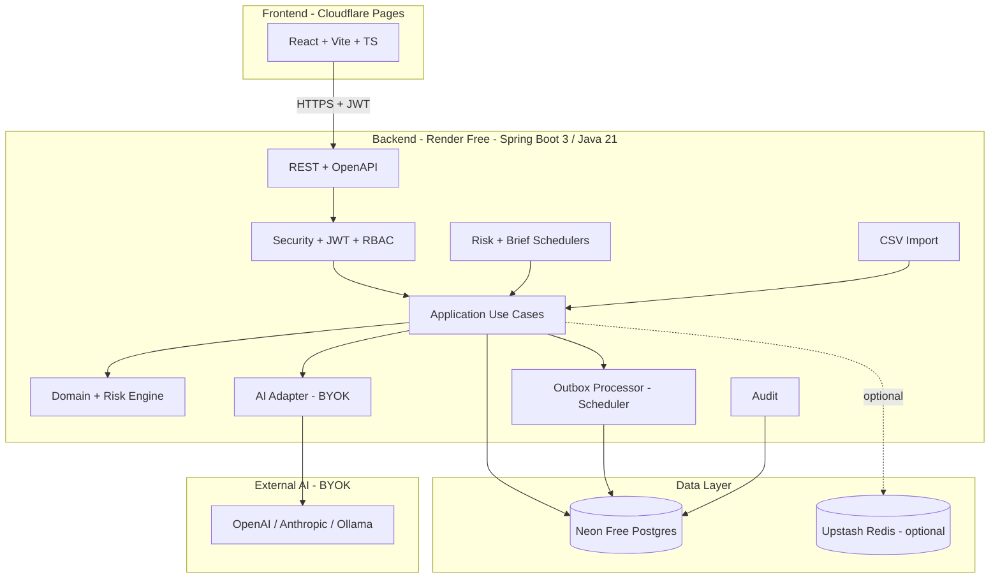
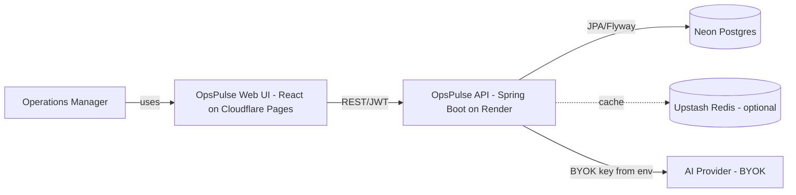
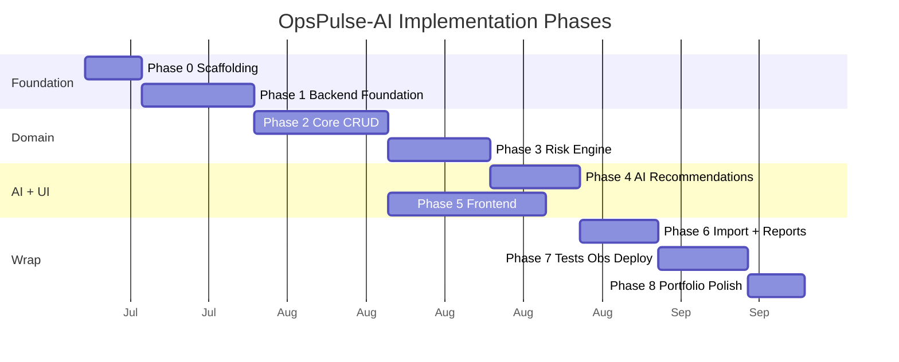

# OpsPulse-AI

> **Java/Spring Boot operations intelligence platform for SMEs** — detect stockout, overstock, order delay, and supplier reliability risks, then generate an AI-assisted daily action plan that reduces manual Excel triage.

[](#) [](#) [](#) [](#)

---

## Why this project exists

Small and medium enterprises lose revenue every day to four avoidable problems:

1. **Stockouts** — items run dry because no one re-ordered in time.
2. **Dead stock** — capital trapped in slow-moving SKUs nobody notices.
3. **Order delays** — orders slip without clear prioritization.
4. **Untracked supplier reliability** — late suppliers keep getting orders.

Managers typically start their day in Excel, manually cross-checking inventory, open orders, and supplier emails. **OpsPulse-AI replaces that 60-minute spreadsheet ritual with a 60-second daily brief** — and the AI never invents the numbers; it narrates and prioritizes risks that a deterministic engine has already computed and audited.

This project is also a **portfolio artifact** demonstrating end-to-end engineering: Java backend, data engineering, AI integration with safety rails, system design, free-tier deployment, and observability.

## Business impact

| Outcome | How OpsPulse-AI helps |
|---|---|
| Reduce stockout incidents | `STOCKOUT_RISK` rule surfaces SKUs whose current stock < avg daily sales × supplier lead time, daily. |
| Reduce dead stock | `SLOW_MOVING_INVENTORY` + `OVERSTOCK_RISK` rules flag SKUs idle for N days or over a multiple of 30-day demand. |
| Reduce order delays | `ORDER_DELAY_RISK` rule ranks at-risk orders by severity so operators act on the right order first. |
| Improve supplier follow-up | `SUPPLIER_DELAY_RISK` ranks suppliers by late-delivery rate; AI drafts follow-up messages. |
| Replace manual triage | A daily AI brief with executive summary + top 5 risks + recommended actions + message drafts. |
| Demonstrable engineering | Modular monolith, hexagonal architecture, PostgreSQL outbox + CloudEvents, BYOK AI with rule-based fallback, free-tier hosted demo. |

## Key features

- **Auth & RBAC** — JWT, refresh rotation, 4 roles (`ADMIN`, `MANAGER`, `OPERATOR`, `VIEWER`).
- **Products, Suppliers, Orders, Purchase Orders, Inventory Movements** — full CRUD with audit log.
- **Transactional inventory** — stock updates, immutable movements, audit, and outbox event in one transaction.
- **Deterministic risk engine** — 6 risk types (`STOCKOUT_RISK`, `OVERSTOCK_RISK`, `SLOW_MOVING_INVENTORY`, `ORDER_DELAY_RISK`, `SUPPLIER_DELAY_RISK`, `LOW_MARGIN_RISK`), pluggable rules, scheduled scan.
- **AI daily operations brief** — provider-agnostic BYOK (OpenAI, Anthropic, Ollama), prompt versioning, audit trail, **rule-based fallback** when AI is unavailable or hallucinates.
- **Dashboard** — total products, open orders, delayed orders, high-risk products, open risks, supplier reliability ranking, top stockout risks, slow-moving list, recent movements, recent risks, latest brief.
- **Reports** — Daily Ops Brief, Inventory Risk, Supplier SLA, Order Delay, Product Margin (JSON-first).
- **CSV import** — idempotent, row-level errors, file-hash dedup, job status tracking.
- **Audit log** — every sensitive action logged with actor, before/after snapshot, request ID.
- **PostgreSQL outbox** — CloudEvents 1.0 envelope, scheduler poller, future Kafka migration without contract change.

## Architecture at a glance



### Container diagram (C4)



## Tech stack

| Layer | Technology |
|---|---|
| Backend | Java 21, Spring Boot 3.x, Spring Web MVC, Spring Security + JWT, Spring Data JPA, Flyway, Spring Scheduler, Spring Boot Actuator, springdoc-openapi |
| AI | Spring AI 1.0 (provider-agnostic), BYOK env-var key, rule-based fallback |
| Database | PostgreSQL (Neon Free), Flyway migrations, JSONB for `source_metrics` and outbox `payload` |
| Cache | Caffeine (default) or Upstash Redis (optional) |
| Tests | JUnit 5, Mockito, Testcontainers, JaCoCo |
| Observability | Actuator + Micrometer + Prometheus + Grafana (local full stack) |
| Frontend | React + Vite + TypeScript + Tailwind (or clean CSS) |
| Deployment | Docker (multi-stage JRE 21 slim), Cloudflare Pages, Render Free, Neon Free |
| Events | PostgreSQL outbox + CloudEvents 1.0 envelope; optional Kafka/Redpanda in local full stack |

## Hosted Slim vs Local Full Stack

| Aspect | Hosted Slim (free demo) | Local Full Stack (dev/observability) |
|---|---|---|
| Frontend | Cloudflare Pages | Vite dev server |
| Backend | Render Free Web Service (Docker) | Spring Boot in Docker Compose |
| Database | Neon Free Postgres | PostgreSQL in Docker Compose |
| Cache | Caffeine (or optional Upstash Redis) | Redis in Docker Compose |
| Event bus | PostgreSQL outbox (in-process consumers) | Outbox + Kafka/Redpanda publishing |
| Metrics | Actuator + Micrometer | Prometheus + Grafana dashboards |
| Cost | $0/month (verified 2026-07-10) | Local machine only |
| Compose file | `docker-compose.yml` (profile `local`) | `docker-compose.full.yml` (profile `fullstack`) |

See [docs/DEPLOYMENT.md](docs/DEPLOYMENT.md) for full topology, env vars, and platform validation.

## Demo links

> Placeholder — populated after Phase 7 deploy.

- **Frontend (Cloudflare Pages):** `https://opspulse-ai.pages.dev` _(TBD)_
- **Backend API (Render):** `https://opspulse-ai.onrender.com` _(TBD)_
- **Swagger UI:** `https://opspulse-ai.onrender.com/swagger-ui.html` _(TBD)_
- **Demo credentials:** _(TBD — documented after deploy; demo-only, no real data)_

## Quick start (local minimal)

Prerequisites: Docker Desktop and Git. Java 21 is required only when running Gradle directly on the host.

```bash
git clone https://github.com/<you>/opspulse-ai.git
cd opspulse-ai
docker compose up --build -d
docker compose ps

# Backend health
curl http://localhost:8080/actuator/health

# Foundation metadata and API documentation
curl http://localhost:8080/actuator/info
curl http://localhost:8080/v3/api-docs
# Swagger UI: http://localhost:8080/swagger-ui.html

# Supply a correlation ID; it is returned in X-Request-Id and error responses
curl -H "X-Request-Id: local-check-1" http://localhost:8080/actuator/health

# Stop services without deleting the PostgreSQL volume
docker compose down
```

The Phase 0 stack contains only the Spring Boot backend and PostgreSQL. Flyway is enabled, but feature migrations and demo data are added in later phases.

To run the build directly with a local Java 21 installation:

```bash
./gradlew clean test bootJar
```

## Quick start (local full stack)

```bash
docker compose -f docker-compose.full.yml up --build
# Redpanda: localhost:9092
# Prometheus: localhost:9090
# Grafana: localhost:3001 (admin/admin)
```

## Deployment overview

OpsPulse-AI targets **free-tier-only** services. Availability and limits were verified on 2026-07-10 but require periodic manual verification before deployment because provider pricing can change:

| Layer | Service | Verified limits |
|---|---|---|
| Frontend | Cloudflare Pages | Unlimited bandwidth/sites; 500 builds/month |
| Backend | Render Free Web Service | 750h/workspace/month; sleeps after 15 min idle |
| Database | Neon Free Postgres | 100 CU-hours/project/month; 0.5 GB storage; scales to zero |
| Cache (optional) | Upstash Redis Free | 500K commands/month; 256 MB data |

Full deploy steps, env vars, and the **platform validation checklist** (must pass before each deploy) live in [docs/DEPLOYMENT.md](docs/DEPLOYMENT.md).

## Screenshots

> Placeholder — populated in Phase 8.

| Page | Screenshot |
|---|---|
| Login | _(TBD)_ |
| Dashboard | _(TBD)_ |
| Risk events | _(TBD)_ |
| AI daily brief | _(TBD)_ |
| CSV import | _(TBD)_ |

## Sample data

The demo dataset (Flyway `R__seed_demo_data.sql`) models a fictional SME distributor:

- **5 users**: 1 admin, 1 manager, 2 operators, 1 viewer (passwords documented post-deploy).
- **30 products** across 5 categories (Widgets, Gadgets, Tools, Consumables, Accessories).
- **8 suppliers** with varied lead times (3 chronically late).
- **60 orders** spanning NEW, CONFIRMED, PICKING, SHIPPED, DELAYED, CANCELLED.
- **20 purchase orders** with realistic delivery performance.
- **~200 inventory movements** over the past 60 days.

Triggering a risk scan + brief on this dataset produces: ~3 critical stockouts, ~2 supplier delays, ~5 slow-moving SKUs, ~4 at-risk orders — enough to demonstrate the brief's value without overwhelming a reviewer.

## API docs

- **Swagger UI (hosted):** `https://opspulse-ai.onrender.com/swagger-ui.html` _(TBD)_
- **OpenAPI spec (hosted):** `https://opspulse-ai.onrender.com/v3/api-docs` _(TBD)_
- **API contract plan:** [docs/API_CONTRACT.md](docs/API_CONTRACT.md)

Endpoint groups: `/api/auth`, `/api/users`, `/api/products`, `/api/suppliers`, `/api/orders`, `/api/inventory-movements`, `/api/purchase-orders`, `/api/risks`, `/api/ai/recommendations`, `/api/reports`, `/api/imports`, `/api/audit-logs`, `/api/dashboard`, `/actuator/health`.

## Known limitations

- **Render cold starts (30–90s)** after 15 min idle — mitigated by a keep-alive ping every 12 min.
- **Neon 0.5 GB storage** — demo dataset ~100 MB; cleanup jobs prune `outbox_events`, `processed_events`, `import_row_errors`.
- **AI brief requires BYOK** — the public hosted demo shows the **rule-based fallback brief** unless the viewer sets `AI_API_KEY` in their own instance.
- **No PDF export** — reports are JSON-first (out of scope per PRD §6).
- **Single-tenant for MVP** — schema has `organization_id` placeholder for future multi-tenant.
- **No WebSockets / SSE** — outbox polling is sufficient for MVP; live dashboard deferred.
- **Single backend instance on Render free** — no HA; durability lives in Neon.

## Future improvements

- Multi-tenant onboarding with `organizations` table + per-tenant isolation.
- PDF report export.
- SSE / WebSocket live dashboard driven by outbox tail.
- Kafka in production (contract already CloudEvents-ready; outbox publishing is the only addition).
- AI-assisted supplier message A/B testing with feedback loop.
- Native image (GraalVM) for sub-second cold starts on free tier.
- Mobile app for operators (warehouse scanning).
- Per-user AI key stored encrypted (multi-tenant only).

## Roadmap

Eight phases from scaffolding to portfolio polish. Full breakdown with deliverables, exit criteria, and issue mapping: [docs/ROADMAP.md](docs/ROADMAP.md).



## Documentation index

| Document | Purpose |
|---|---|
| [docs/PRD.md](docs/PRD.md) | Product requirements — users, goals, FR/NFR, out-of-scope, success metrics |
| [docs/ARCHITECTURE.md](docs/ARCHITECTURE.md) | Module boundaries, request flow, risk flow, AI flow, outbox flow, Mermaid diagrams |
| [docs/DATA_MODEL.md](docs/DATA_MODEL.md) | Entity list, table designs, indexes, ER diagram, Flyway strategy |
| [docs/API_CONTRACT.md](docs/API_CONTRACT.md) | Endpoint inventory, RBAC matrix, examples, error envelope, OpenAPI |
| [docs/ADR/](docs/ADR/) | 7 Architecture Decision Records (Spring Boot, Outbox, BYOK, Free-tier, Risk-first, CloudEvents, Spring AI) |
| [docs/ROADMAP.md](docs/ROADMAP.md) | 8-phase implementation plan with exit criteria |
| [docs/DEPLOYMENT.md](docs/DEPLOYMENT.md) | Cloudflare + Render + Neon + Upstash; env vars; platform validation checklist |
| [docs/RISK_REGISTER.md](docs/RISK_REGISTER.md) | 15 technical & product risks with mitigations and review cadence |
| [docs/GITHUB_ISSUES.md](docs/GITHUB_ISSUES.md) | ~55 suggested issues with labels, milestones, acceptance criteria |

## License

MIT — see [LICENSE](LICENSE).

## Author

Built as a portfolio project by Pakon Poomson — Java backend, data engineering, AI integration, and system design.
