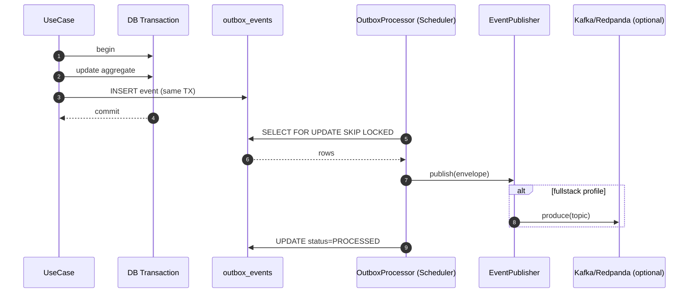

# ADR-002 — Use PostgreSQL Outbox in the Hosted Demo

- **Status:** Accepted
- **Date:** 2026-07-10
- **Review date:** 2026-10-10
- **Decision owner:** Portfolio project

## Context

The platform needs reliable domain event publication for downstream consumers (audit, dashboard cache invalidation, future analytics, brief triggers). On the **hosted slim** stack we cannot run Kafka/Redpanda without exceeding free-tier compute (NFR-1, NFR-9).

We still want a clean future migration path to Kafka/Redpanda for the **local full stack** profile without changing domain code or event contracts.

## Decision

Use the **PostgreSQL Outbox Pattern** with a Spring Scheduler poller:

1. Domain use cases append rows to `outbox_events` in the **same database transaction** as the state change.
2. A `OutboxProcessor` Spring Scheduler polls `outbox_events` rows with `status IN (NEW, RETRY)` using `SELECT ... FOR UPDATE SKIP LOCKED`, dispatches them, and marks `PROCESSED` (or `RETRY`/`DEAD`).
3. The `payload` column stores a CloudEvents 1.0 envelope (see [ADR-006](ADR-006-use-cloudevents-compatible-outbox-envelope.md)).
4. In the `fullstack` profile, the publisher additionally produces the same CloudEvents envelope to Kafka/Redpanda — no domain change required.

## Outbox Sequence

## Consequences

**Positive**
- No external broker required for hosted demo; no extra RAM/CPU.
- Atomic with state change — events are never lost when DB commits.
- Same payload shape publishes to Kafka later with zero domain change.
- At-least-once delivery with idempotent consumers via `processed_events` dedup table.

**Negative**
- At-least-once (not exactly-once) — consumers must be idempotent.
- Polling adds DB load; mitigated by `SKIP LOCKED` + small batch + backoff when no rows.
- Delivery latency bounded by scheduler interval (default 5s) — acceptable for ops brief context.

**Neutral**
- Requires retry/backoff and poison-message handling (DEAD status, admin replay).

## Alternatives Considered

| Alternative | Why rejected |
|---|---|
| Kafka / Redpanda in hosted demo | Exceeds free-tier compute and memory; ops overhead. |
| RabbitMQ | Another service to run; no free-tier managed option that pairs with Neon. |
| In-process Spring `ApplicationEventPublisher` | Lost on crash; not durable; no cross-service replay. |
| Postgres LISTEN/NOTIFY | Good for low volume, but listeners disconnect on idle/sleep and require long-lived connections — fragile on free-tier. Used as **wake-up hint** optionally, but the poller remains source of truth. |

## Compliance & Validation

- Unit test: outbox row inserted iff aggregate state committed (transactional test).
- Integration test: outbox processor moves row NEW → PROCESSED within scheduler interval.
- Idempotency test: replaying same CloudEvents `id` does not double-apply state.
- Local fullstack test: same payload publishes to Redpanda topic; consumer reads identical envelope.

## References

- [ARCHITECTURE.md §8 — Outbox flow](../ARCHITECTURE.md#8-outbox-flow)
- [ADR-006 — CloudEvents envelope](ADR-006-use-cloudevents-compatible-outbox-envelope.md)
- [DATA_MODEL.md §2.15 — outbox_events](../DATA_MODEL.md)
