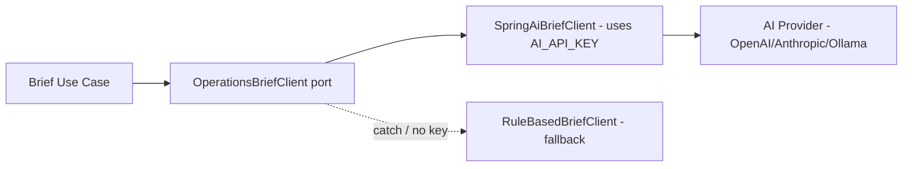

# ADR-003 — Use BYOK AI Provider

- **Status:** Accepted
- **Date:** 2026-07-10
- **Review date:** 2026-10-10
- **Decision owner:** Portfolio project

## Context

The platform has an AI Daily Operations Brief feature (PRD FR-8, FR-9). Running a hosted AI model or paying for a managed AI gateway would violate the hard free-tier constraint (NFR-9). Embedding any API key in the codebase or demo environment is a security failure (NFR-4) and exposes personal cost risk.

The portfolio audience must be able to try the brief feature without me paying for their tokens.

## Decision

Adopt a **Bring Your Own Key (BYOK)** model:

1. The user (operator of their own deployed instance) provides an AI provider API key via the environment variable `AI_API_KEY` (and optional `AI_PROVIDER`, `AI_MODEL`, `AI_BASE_URL`).
2. The backend exposes a **provider-agnostic port** `OperationsBriefClient` (see [ARCHITECTURE.md §12](../ARCHITECTURE.md#12-ai-provider-agnostic-adapter-contract)).
3. Adapters:
   - `SpringAiBriefClient` (selected by ADR-007) — primary, used when `AI_API_KEY` is present.
   - `RuleBasedBriefClient` — fallback when key is absent OR primary client throws.
4. The key is read **once** from the backend environment at adapter construction — never logged, never returned in any DTO, never persisted.

## AI Adapter Port Diagram

## Consequences

**Positive**
- Zero AI cost to the portfolio owner; demo viewers self-serve.
- No secrets in the codebase; satisfies NFR-4.
- Provider-agnostic: swapping OpenAI ↔ Anthropic ↔ Ollama is config-only.
- Fallback brief keeps the feature useful even without a key (recruiters can still see the flow).

**Negative**
- Hosted demo's AI brief is non-functional until the viewer sets `AI_API_KEY` in their own instance — the public demo shows the **rule-based fallback brief**.
- Cannot benchmark real provider latency in the public demo; mitigated by documenting expected behavior.

**Neutral**
- Need explicit UI labelling: "AI brief disabled — showing rule-based brief. Set `AI_API_KEY` to enable AI." (FR-9)

## API Key Handling Rules

| Surface | Allowed? |
|---|---|
| Logs (any level) | NO |
| Exception messages | NO (sanitized error class only) |
| HTTP response body | NO |
| OpenAPI examples | NO (use placeholder `<AI_API_KEY>`) |
| DB persistence | NO |
| Frontend env | NO |
| Backend env var only | YES |
| AI adapter memory (transient) | YES (read once, held in char[]/String, never serialized) |

## Alternatives Considered

| Alternative | Why rejected |
|---|---|
| Hardcoded demo key (rate-limited) | Personal cost; key leakage risk; violates NFR-4. |
| Netlify AI Gateway / Vercel AI Gateway | Ties deployment to that platform; not aligned with Render + Cloudflare Pages choice; still needs a key. |
| On-device open model (Ollama) in hosted demo | No free-tier GPU/CPU budget for an LLM on Render Free. Allowed as a local-only adapter. |
| Per-user key stored in DB (encrypted) | Adds key-management surface area; not justified for portfolio MVP. Future option for multi-tenant. |

## Compliance & Validation

- Static check: no occurrence of `AI_API_KEY` value in any log line (grep test on log fixtures).
- Unit test: `RuleBasedBriefClient` returns valid brief shape when `OperationsBriefClient` throws.
- Integration test: when `AI_API_KEY` unset, brief endpoint returns 200 with `generatedBy=RULE_BASED`.
- Code review checklist: adapter never adds key to DTO/audit/exception.

## References

- [PRD.md §FR-9 — AI Safety](../PRD.md)
- [ARCHITECTURE.md §7 — AI recommendation flow](../ARCHITECTURE.md#7-ai-recommendation-flow)
- [ADR-007 — AI framework selection](ADR-007-ai-framework-selection-spring-ai-vs-langchain4j.md)
