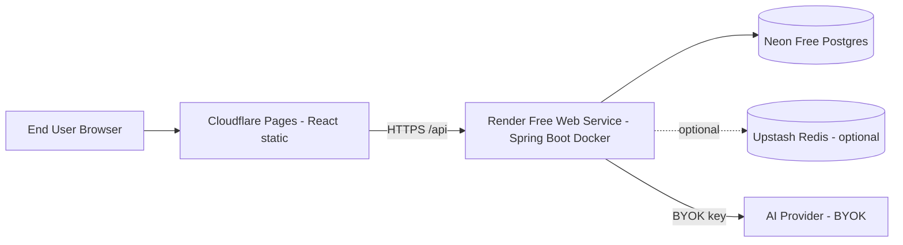

# ADR-004 — Slim Free-Tier Deployment

- **Status:** Accepted
- **Date:** 2026-07-13
- **Review date:** 2026-10-13 (free-tier status drifts; re-verify quarterly)
- **Decision owner:** Portfolio project

## Context

The hosted demo must be deployable on **long-term free services only** (NFR-9). No short-lived free trials. No required paid service. The hosted stack must be lightweight enough to fit within constrained free-tier CPU/RAM (NFR-1).

This ADR selects the hosted-slim deployment topology and records a **historical free-tier baseline** for each platform as of 2026-07-13. Hosted provisioning has not been performed in this phase, so every provider limit and free-tier claim must be re-verified immediately before deployment; the review cadence below is mandatory.

## Decision

The deployment topology below is a historical baseline only. Hosted
provisioning has not been performed, so all provider limits and free-tier
availability require manual verification immediately before deployment.

Adopt the following hosted-slim topology:

| Layer | Service | Historical baseline (2026-07-13; re-verify before deployment) |
|---|---|---|
| Frontend | **Cloudflare Pages** | Permanent free plan; unlimited sites/bandwidth/static requests; 500 builds/month; 20,000 files/site; 25 MiB max file; 100 custom domains/project. Source: [developers.cloudflare.com/pages/platform/limits](https://developers.cloudflare.com/pages/platform/limits/) |
| Backend | **Render Free Web Service** (Docker) | Permanent free plan; 750 instance-hours/workspace/month; spins down after 15 min idle; cold start about 1 minute; 5 GB outbound bandwidth/month; 500 build minutes/month; single instance; no persistent disk, inbound private networking, or shell access. WebSockets are supported. Source: [render.com/docs/free](https://render.com/docs/free) |
| Database | **Neon Free Postgres** | Permanent free plan ($0/mo, not a trial); 100 projects; 100 CU-hours/project/month (doubled Oct 2025); 0.5 GB storage/project; 5 GB egress/project/month; scale-to-zero after 5 min idle (mandatory); autoscale up to 2 CU (~8 GB RAM); 104 max connections. Source: [neon.com/faqs/free-plan-limits-and-quotas](https://neon.com/faqs/free-plan-limits-and-quotas) |
| Optional cache | **Upstash Redis Free** | Permanent free plan; 500,000 commands/month (changed from 10K/day in Mar 2025); 256 MB data; 10 GB bandwidth/month; single region. Source: [upstash.com/pricing/redis](https://upstash.com/pricing/redis) |

> If any platform drops or materially changes its free tier before deployment, treat as a risk trigger: see [RISK_REGISTER.md](../RISK_REGISTER.md) R-11 and re-run the validation checklist in [DEPLOYMENT.md §10](../DEPLOYMENT.md).

## Hosted Slim Topology

## Consequences

**Positive**
- $0/month recurring cost for hosted demo.
- All four are permanent (non-trial) free tiers as of 2026-07-13.
- Cloudflare Pages has unlimited bandwidth — frontend cost is effectively uncapped.
- Neon scales to zero — idle portfolio demo accrues near-zero compute hours.
- Render Docker support lets us ship a slim multi-stage JRE image.

**Negative**
- **Render cold starts**: about 1 minute after 15 min idle. The free demo accepts this and shows a clear waking-up state; no keep-alive job is required. (See R-02.)
- **Render 750h cap**: one continuously running service can consume 744 hours in a 31-day month, leaving only 6 shared workspace hours. Allowing idle spin-down preserves quota and avoids unnecessary automation.
- **Neon 0.5GB storage**: demo dataset is ~30 products, 60 orders, 20 POs, ~200 movements — comfortably < 100MB. Risk if audit_logs/outbox_events grow unbounded → mitigate with cleanup jobs ([DATA_MODEL.md §12](../DATA_MODEL.md)).
- **Neon 100 CU-hours**: scale-to-zero means idle demo uses ~0 CU; active bursts autoscale to 2 CU. 100 CU-hours covers ~400 hours at 0.25 CU — ample for a low-traffic demo.
- **Neon 5 min idle wake latency**: first query after idle pays ~hundreds of ms wake; mitigated by frontend retry + small loading state.
- **No live push in the MVP**: Render supports WebSockets, but outbox polling is sufficient and survives free-instance restarts with less stateful connection handling. SSE/WebSockets remain optional future work.
- **No persistent disk on Render free**: state lives in Neon only; no local file storage. CSV uploads handled in-memory/streaming and persisted as `import_jobs` rows in Postgres.

**Neutral**
- Render may restart free services at any time — application must be stateless and rely on Postgres for durability (already an architecture principle).

## Alternatives Considered

| Alternative | Comparison |
|---|---|
| **Fly.io** | Has free allowance but requires credit card and has had free-tier reductions; smaller Java/spring ecosystem familiarity. |
| **Railway** | No permanent free tier (trial credit only) — disqualified by NFR-9. |
| **Koyeb** | Has free tier but smaller community and less predictable limits. |
| **Supabase Postgres** | Free 500MB but **pauses project after 7 days idle** — bad for a portfolio demo that may go unvisited for weeks. Neon's scale-to-zero keeps data hot. |
| **Aurora/RDS Free Tier** | 12-month-only trial — disqualified by NFR-9. |
| **Self-hosted Postgres on Render free disk** | Render free has no persistent disk — disqualified. |
| **Cloudflare Workers/D1 backend** | Would force a different stack (JS/TS edge) than the Java/Spring portfolio target. |
| **Vercel for backend** | Vercel Functions are not Java-friendly; backend belongs on Render. |

## Compliance & Validation

- A `docs/DEPLOYMENT.md §10 Platform Validation Checklist` table tracks each platform's: free-plan URL, last-verified date, hard limits, and a "requires manual verification" flag if any future check fails.
- Pre-deploy script (Phase 7) prints the chosen plan names and exits non-zero if any env var (`RENDER_SERVICE_ID`, `NEON_DATABASE_URL`, `CLOUDFLARE_PROJECT`) is missing.
- Post-deploy smoke test: `curl /actuator/health` returns 200 within 90s of cold start; dashboard endpoint returns 200 within 5s warm.
- Monthly checklist (manual, calendar reminder): re-confirm each platform's free-tier page still lists a free plan; if any removed, raise an issue and migrate.

## Review Cadence

- **Quarterly**: re-verify each platform's free-tier page; update this ADR's status table and the DEPLOYMENT checklist.
- **On incident**: if a platform suspends the demo, update this ADR with the alternative chosen and link the post-mortem.

## References

- [PRD.md §NFR-9 — Cost](../PRD.md)
- [DEPLOYMENT.md §10 — Platform Validation Checklist](../DEPLOYMENT.md)
- [RISK_REGISTER.md R-11 — Deployment platform changes](../RISK_REGISTER.md)
- Render Free docs: https://render.com/docs/free
- Neon Free FAQ: https://neon.com/faqs/free-plan-limits-and-quotas
- Cloudflare Pages limits: https://developers.cloudflare.com/pages/platform/limits/
- Upstash Redis pricing: https://upstash.com/pricing/redis
