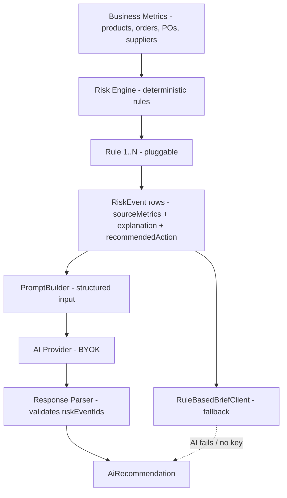

# ADR-005 — Risk Engine Before AI

- **Status:** Accepted
- **Date:** 2026-07-10
- **Review date:** 2026-10-10
- **Decision owner:** Portfolio project

## Context

The platform's headline AI feature is the **Daily Operations Brief**. The naive approach is to feed the AI raw business state ("here is all the inventory and orders, write me a brief"). This has three serious problems:

1. **Hallucination risk** — an LLM can invent metrics ("supplier X is 40% late") that are not grounded in the data.
2. **Non-reproducibility** — the same inputs produce different outputs run-to-run; debugging is impossible.
3. **Un-auditability** — a manager cannot tell *why* a risk was raised, so cannot trust the recommendation.

For an operations tool used to make purchasing and customer-communication decisions, trust matters more than novelty. PRD FR-7, FR-9 require auditable risk events and AI explainability.

## Decision

Adopt a **deterministic-first, AI-second** pipeline:

1. A **Risk Engine** computes structured `RiskEvent` rows from auditable business rules (`STOCKOUT_RISK`, `OVERSTOCK_RISK`, `SLOW_MOVING_INVENTORY`, `ORDER_DELAY_RISK`, `SUPPLIER_DELAY_RISK`, `LOW_MARGIN_RISK`).
2. Each `RiskEvent` carries `sourceMetrics` (JSONB of the exact numbers that triggered it), `explanation` (deterministic text), `severity`, and `recommendedAction` (deterministic).
3. The **AI Brief Use Case** consumes only `RiskEvent` rows (+ their `sourceMetrics`) as structured input — never raw aggregates computed by the prompt.
4. The AI response must reference `riskEventIds` and the underlying `sourceMetrics`; any AI claim that does not map to a known risk event is treated as a hallucination and filtered out by the response parser.
5. If the AI call fails or `AI_API_KEY` is absent, a **RuleBasedBriefClient** renders the same risk events into a deterministic brief (top 5 by severity, recommended actions copied from risk events, message drafts templated).

## Risk → AI Flow



## Consequences

**Positive**
- Auditable: every risk event has deterministic `sourceMetrics` + `explanation` that a manager can verify.
- Reproducible: same input → same risk events → roughly same brief (modulo AI variance).
- Hallucination-resistant: AI cannot invent metrics; it only narrates and prioritizes existing risks + drafts messages.
- AI failure is graceful: rule-based brief preserves the feature's core value.
- Pluggable rules: new risk types are a new `RiskRule` bean — no core flow change (NFR-2).
- Portfolio narrative: clearly demonstrates "AI assists, deterministic logic decides" — a mature engineering stance.

**Negative**
- Brief quality ceiling is bounded by rule quality. If a rule is wrong, AI cannot fix it.
- Two code paths to maintain (AI + fallback). Mitigated by shared `BriefResponse` model and shared prompt/fallback builder for actions.
- More upfront design: rule thresholds must be tunable via `app_config` (NFR-2).

**Neutral**
- Rule thresholds are config-driven; sensible defaults from PRD FR-7.

## Rule Contract

```java
interface RiskRule {
  RiskType type();
  Optional<RiskEvent> evaluate(RiskContext ctx);
}
```

`RiskContext` provides typed access to product, supplier, order, PO, movement history, and config thresholds — rules never read raw SQL or compute aggregates themselves (aggregates pre-computed by `MetricRepository`).

## Severity Mapping (deterministic)

| Severity | Heuristic |
|---|---|
| LOW | Trigger within 2x threshold |
| MEDIUM | Trigger within 1.5x threshold |
| HIGH | Trigger at threshold |
| CRITICAL | Trigger past threshold + secondary signal |

Severity is set by the rule, not by the AI.

## Compliance & Validation

- Unit tests per rule: given a `RiskContext`, the rule produces the expected `RiskEvent` (or empty).
- Property test: for any brief, every `recommendedAction` references a `riskEventId` that exists in the input set.
- Integration test: with `AI_API_KEY` unset, brief endpoint returns 200 with `generatedBy=RULE_BASED` and valid actions.
- Hallucination guard test: feed the AI a mocked response that references a non-existent `riskEventId`; the parser rejects it and the fallback brief is used.

## Alternatives Considered

| Alternative | Why rejected |
|---|---|
| Pure AI brief (no risk engine) | Hallucination, non-reproducibility, no audit trail. Violates FR-9. |
| Pure rule-based (no AI) | Loses portfolio AI signal; loses narrative quality of message drafts; fails FR-8 intent. |
| AI computes metrics, rules audit | Worst of both — AI is slow per-request and rules can't audit AI's hidden math. |
| Hybrid with AI as rule generator | Adds prompt-injection risk and non-deterministic rule sets. Out of scope for MVP. |

## References

- [PRD.md §FR-7 — Risk Engine](../PRD.md)
- [PRD.md §FR-9 — AI Safety](../PRD.md)
- [ARCHITECTURE.md §6 — Risk calculation flow](../ARCHITECTURE.md#6-risk-calculation-flow)
- [ARCHITECTURE.md §7 — AI recommendation flow](../ARCHITECTURE.md#7-ai-recommendation-flow)
- [ADR-003 — BYOK AI provider](ADR-003-use-byok-ai-provider.md)
