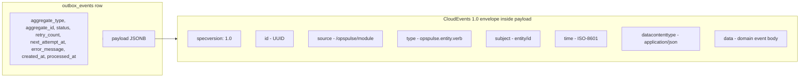

# ADR-006 — Use CloudEvents-Compatible Outbox Envelope

- **Status:** Accepted
- **Date:** 2026-07-10
- **Review date:** 2026-10-10
- **Decision owner:** Portfolio project

## Context

The outbox pattern ([ADR-002](ADR-002-use-postgresql-outbox-in-hosted-demo.md)) writes domain events to a PostgreSQL `outbox_events` table and dispatches them via a Spring Scheduler poller. In the hosted slim profile, the dispatcher invokes in-process consumers. In the local full stack profile, the dispatcher additionally publishes the same events to Kafka/Redpanda.

We want the **domain event contract to remain identical** whether the consumer is in-process, Kafka, Redpanda, or a future cloud event bus — so we never have to rewrite consumers when we change transport.

## Decision

The `outbox_events.payload` JSON column stores a **CloudEvents 1.0** compliant envelope.

### CloudEvents Envelope Structure

```json
{
  "specversion": "1.0",
  "id": "550e8400-e29b-41d4-a716-446655440000",
  "source": "/opspulse/products",
  "type": "opspulse.product.stock.changed",
  "subject": "product/550e8400-...",
  "time": "2026-07-10T01:30:00Z",
  "datacontenttype": "application/json",
  "data": {
    "productId": "550e8400-...",
    "delta": -5,
    "newStock": 42,
    "reason": "order/ORD-1001"
  }
}
```

### Mapping to outbox columns

| CloudEvents field | Stored in | Notes |
|---|---|---|
| `id` | `payload.id` (UUID) | consumer dedup key; also persisted in `processed_events.event_id` |
| `source` | `payload.source` | `/opspulse/{module}` |
| `type` | `payload.type` AND `outbox_events.event_type` | dual-write for indexed querying |
| `subject` | `payload.subject` | `{entityType}/{entityId}` |
| `time` | `payload.time` AND `outbox_events.created_at` | ISO-8601 UTC |
| `datacontenttype` | `payload.datacontenttype` | always `application/json` for MVP |
| `data` | `payload.data` | the domain event body |
| — | `outbox_events.aggregate_type` | module name for routing |
| — | `outbox_events.aggregate_id` | root entity id for partitioning |
| — | `outbox_events.status` | NEW / RETRY / PROCESSED / DEAD |
| — | `outbox_events.retry_count` | retry attempts |
| — | `outbox_events.next_attempt_at` | backoff scheduler |
| — | `outbox_events.error_message` | sanitized error |
| — | `outbox_events.processed_at` | success timestamp |

### Envelope Structure Diagram



## Consequences

**Positive**
- Transport portability: in-process → Kafka → Redpanda → cloud event bus with no consumer rewrite.
- Standard tooling: CloudEvents SDKs (Java, Go, JS) can deserialize envelopes generically.
- Future-proof for tracing: CloudEvents fields map cleanly to OpenTelemetry Baggage and W3C Trace Context.
- Portfolio signal: demonstrates awareness of CNCF standards and event-driven design.

**Negative**
- Slight verbosity: 7 envelope fields overhead per event. Acceptable for ops-event volume.
- Consumers must understand CloudEvents (low effort; SDK available).
- We do not use Avro/Protobuf + Schema Registry (would add infra); JSON is sufficient for MVP and simpler to debug.

**Neutral**
- `datacontenttype` reserved for future non-JSON payloads (e.g., Avro).

## Event Type Catalog (initial)

| `type` | `source` | `data` summary |
|---|---|---|
| `opspulse.product.created` | `/opspulse/products` | product snapshot |
| `opspulse.product.updated` | `/opspulse/products` | product diff |
| `opspulse.product.stock.changed` | `/opspulse/products` | productId, delta, newStock, reason |
| `opspulse.order.created` | `/opspulse/orders` | order snapshot |
| `opspulse.order.status.changed` | `/opspulse/orders` | orderId, oldStatus, newStatus |
| `opspulse.order.delayed` | `/opspulse/orders` | orderId, reason |
| `opspulse.po.sent` | `/opspulse/purchase-orders` | poId, supplierId |
| `opspulse.po.received` | `/opspulse/purchase-orders` | poId, items received |
| `opspulse.supplier.created` | `/opspulse/suppliers` | supplier snapshot |
| `opspulse.risk.created` | `/opspulse/risk` | riskEventId, riskType, severity |
| `opspulse.risk.resolved` | `/opspulse/risk` | riskEventId, resolver |
| `opspulse.brief.generated` | `/opspulse/ai` | briefId, promptVersion, generatedBy |
| `opspulse.import.completed` | `/opspulse/imports` | jobId, counts |

## Serialization Rules

- `id` is a UUID v4 generated by the use case at event creation time.
- `time` is `Instant.now()` ISO-8601 UTC with `Z` suffix.
- `data` is a JSON object; no binary in MVP.
- The envelope is built by `CloudEventsEnvelopeBuilder` in `infrastructure/outbox` — domain code does not construct envelopes directly (it calls `OutboxPublisher.publish(aggregateType, aggregateId, eventType, data)`).

## Compliance & Validation

- Unit test: `CloudEventsEnvelopeBuilder` produces envelope with all 8 required fields populated.
- Unit test: every event type in the catalog has a corresponding builder test fixture.
- Integration test: outbox row inserted with `payload` JSONB parses as CloudEvents 1.0 (schema validation via `io.cloudevents:cloudevents-api`).
- Integration test (fullstack): same `payload` published to Redpanda is consumable by a Java CloudEvents consumer without transport-specific decoding.

## Alternatives Considered

| Alternative | Why rejected |
|---|---|
| Custom JSON shape (no CloudEvents) | Locks consumers to our schema; future transport migration requires consumer rewrite. |
| Avro + Schema Registry | Requires extra infra (registry) not viable on free-tier; JSON sufficient for MVP volume. |
| Protobuf | Same infra concern as Avro; harder to inspect/debug. |
| AWS EventBridge / GCP Eventarc envelopes | Cloud-vendor lock-in; CloudEvents is vendor-neutral and accepted by both. |

## References

- CloudEvents 1.0 spec: https://github.com/cloudevents/spec
- CloudEvents Java SDK: https://github.com/cloudevents/sdk-java
- [ADR-002 — PostgreSQL Outbox](ADR-002-use-postgresql-outbox-in-hosted-demo.md)
- [ARCHITECTURE.md §8 — Outbox flow](../ARCHITECTURE.md#8-outbox-flow)
- [ARCHITECTURE.md §14 — Event catalog](../ARCHITECTURE.md#14-cross-module-event-catalog)
- [DATA_MODEL.md §7 — Outbox CloudEvents schema](../DATA_MODEL.md)
