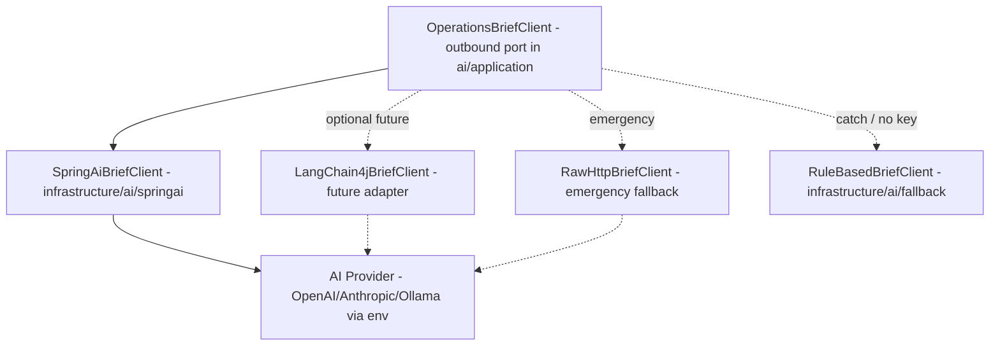

# ADR-007 — AI Framework Selection: Spring AI vs LangChain4j

- **Status:** Accepted
- **Date:** 2026-07-10
- **Review date:** 2026-10-10
- **Decision owner:** Portfolio project

## Context

The AI Daily Operations Brief ([PRD FR-8](../PRD.md)) needs a Java client that:

1. Supports multiple providers (OpenAI, Anthropic, Ollama) behind one interface (BYOK — [ADR-003](ADR-003-use-byok-ai-provider.md)).
2. Supports prompt templating with version persistence ([PRD FR-9](../PRD.md), `prompt_versions` table).
3. Supports timeout, retry, and structured output parsing (JSON).
4. Has a low memory footprint (free-tier Render < 512MB — [ADR-004](ADR-004-slim-free-tier-deployment.md)).
5. Is mature enough for a portfolio artifact and actively maintained.
6. Does not leak the API key into logs or DTOs.

The two candidates are **Spring AI** (Spring-native, 1.0 GA released 2025) and **LangChain4j** (LangChain port, broader provider/tooling surface, smaller Spring footprint). A third fallback is a raw HTTP client (Java `HttpClient`).

## Decision

**Adopt Spring AI 1.0.x as the primary AI client framework**, wrapped behind our own `OperationsBriefClient` port so the framework is replaceable.

### Rationale

- **Spring-native**: shares Spring Boot auto-config, dependency injection, observability (Micrometer), and retry (`@Retryable`) — already in our stack.
- **Provider abstraction**: `ChatClient` + `ChatModel` interface with OpenAI, Anthropic, Ollama, Azure OpenAI, Google Vertex, Bedrock, Mistral, HuggingFace, etc. adapters built-in. BYOK via `spring.ai.openai.api-key` (or per-provider) env var.
- **Structured output**: `BeanOutputConverter` / `StructuredOutputConverter` parses JSON responses directly into `BriefResponse` — eliminates hand-rolled JSON parsing for the brief.
- **Prompt templating**: `PromptTemplate` with externalized template strings (stored in `prompt_versions.template`) — directly supports FR-9 prompt versioning.
- **Observability**: built-in Micrometer timers and `ChatModel` observation handlers → reuses our Actuator/Prometheus setup (NFR-6).
- **Footprint**: dependency weight is modest; Spring AI core + one provider runtime is acceptable within 512MB with our JVM tuning.
- **Portfolio recognition**: Spring AI is the most natural choice on a Spring Boot 3 / Java 21 project and signals idiomatic Spring engineering.

### Why not LangChain4j as primary

LangChain4j is excellent and a strong second choice. Reasons to prefer Spring AI on this project:

- Adds another dependency family (Quarkus-leaning) on top of an otherwise pure-Spring stack.
- Its AI Services DSL is powerful but slightly more code than Spring AI's `ChatClient` fluent API for our single use case (a brief).
- Spring AI's `ChatClient` integrates natively with Spring Observability and `@RetryableTopic`-style patterns we already use.

We will keep `OperationsBriefClient` as a port so a `LangChain4jBriefClient` adapter can be added later if Spring AI's roadmap disappoints.

### Why not raw HTTP client

- Manual retry/timeout/structured-output parsing reinvents Spring AI.
- No native observability hooks.
- Acceptable as a **third fallback adapter** only if both Spring AI and LangChain4j fail in a specific scenario (e.g., a niche provider with no SDK).

## Adapter Layout

## Comparison Matrix

| Criterion | Spring AI 1.0 | LangChain4j 0.36+ | Raw HttpClient |
|---|---|---|---|
| Spring Boot integration | Native (auto-config) | Good (Spring Boot starter) | None |
| Provider abstraction | Broad | Broad | Manual |
| Prompt templating | `PromptTemplate` | `UserMessage` templates | Manual |
| Structured output | `BeanOutputConverter` | `AiServices` with return type | Manual |
| Observability | Micrometer-native | Manual / OpenTelemetry | None |
| Retry/timeout | Spring Retry + Resilience4j | Built-in retries | Manual |
| Memory footprint | Medium | Medium | Low |
| License | Apache 2.0 | Apache 2.0 | n/a |
| Maturity (2026) | 1.0 GA (2025) | Mature, active | n/a |
| BYOK friendliness | High (env-based) | High | High |
| Portfolio fit for Spring project | Best | Good | Weak |

## Consequences

**Positive**
- One idiomatic AI client framework aligned with the Spring stack.
- Structured output parsing eliminates a class of prompt-injection and JSON-parse bugs.
- Observability comes for free via Micrometer — AI latency/token usage flow into Actuator/Prometheus (NFR-6).
- `OperationsBriefClient` port keeps the framework swappable; we never leak Spring AI types into domain.

**Negative**
- Spring AI 1.0 is newer than LangChain4j; minor API churn possible across 1.0.x patch releases. Mitigation: pin minor version in `build.gradle`.
- Extra dependency weight vs raw HTTP; acceptable given the benefits.
- Some providers (e.g., Ollama for local-only) need separate `ChatModel` bean configuration — manageable via Spring profiles.

**Neutral**
- We do not use Spring AI's vector store / RAG features in MVP — they are available if Phase 8+ adds semantic supplier/order search.

## API Key Handling (per ADR-003)

- `AI_API_KEY`, `AI_PROVIDER`, `AI_MODEL`, `AI_BASE_URL` env vars.
- Spring AI config: `spring.ai.openai.api-key: ${AI_API_KEY:}` (or provider-specific).
- When `AI_API_KEY` is empty/absent, `SpringAiBriefClient` is **not instantiated**; `RuleBasedBriefClient` is the only bean. Achieved via `@ConditionalOnProperty`.
- The key is never logged. Spring AI's own logging is set to `WARN` for `org.springframework.ai` to avoid accidental prompt/key leakage in DEBUG.

## Compliance & Validation

- Unit test: `SpringAiBriefClient` with mocked `ChatClient` returns a `BriefResponse` matching the prompt's structured output.
- Unit test: when `AI_API_KEY` unset, the application context does not contain `SpringAiBriefClient` bean (conditional validation).
- Integration test: against a stubbed OpenAI-compatible endpoint (WireMock), verify timeout (15s) and one retry on 5xx, no retry on 4xx.
- Static check: no `AI_API_KEY` literal or its value appears in any log line across test fixtures.

## Alternatives if Spring AI blocks us

1. Switch primary adapter to `LangChain4jBriefClient` (port unchanged).
2. For a niche provider, add `RawHttpBriefClient`.
3. If AI is permanently unavailable in a deployment, `RuleBasedBriefClient` is the only bean and the feature degrades gracefully.

## References

- Spring AI docs: https://docs.spring.io/spring-ai/reference/
- LangChain4j docs: https://docs.langchain4j.dev
- [PRD.md §FR-8 — AI Brief](../PRD.md)
- [PRD.md §FR-9 — AI Safety](../PRD.md)
- [ADR-003 — BYOK](ADR-003-use-byok-ai-provider.md)
- [ARCHITECTURE.md §7 — AI flow](../ARCHITECTURE.md#7-ai-recommendation-flow)
- [ARCHITECTURE.md §12 — Adapter contract](../ARCHITECTURE.md#12-ai-provider-agnostic-adapter-contract)
