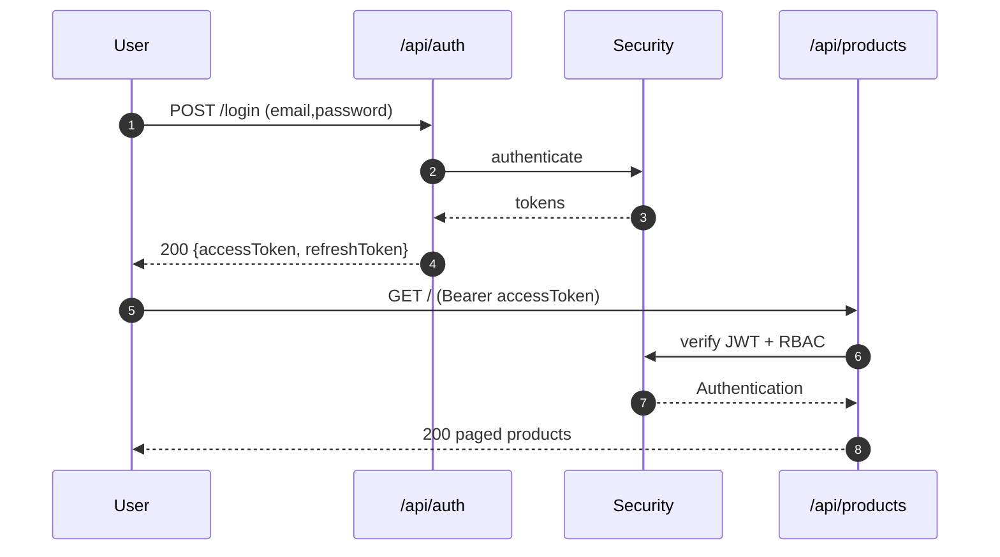
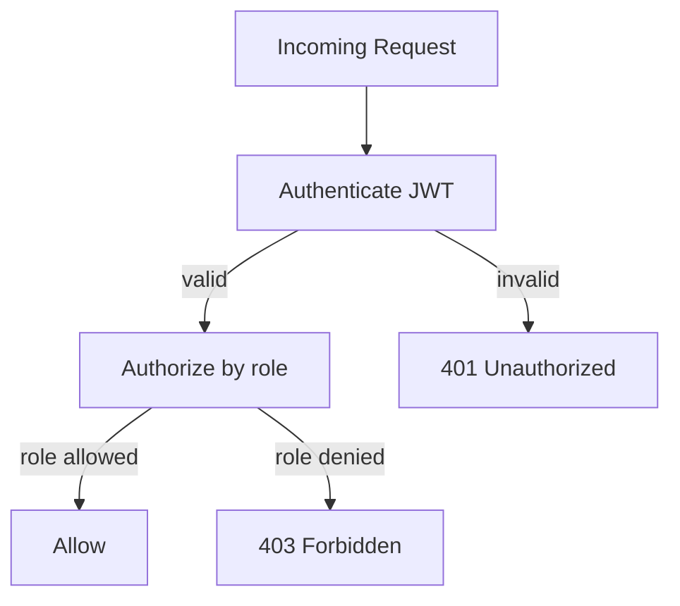
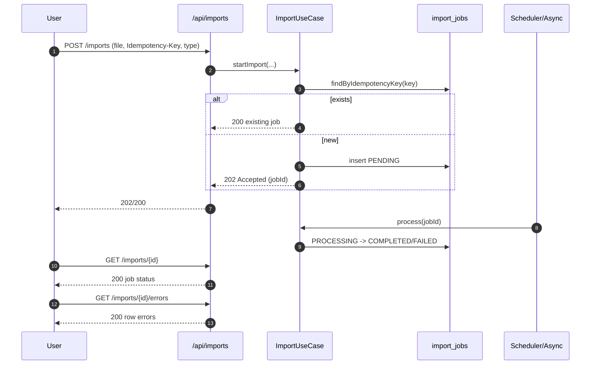

# OpsPulse-AI — API Contract

> Status: Draft v0.1
> Last updated: 2026-07-10
> Base URL (hosted demo): `https://<render-service>.onrender.com/api`
> Base URL (local): `http://localhost:8080/api`
> OpenAPI spec served at `/v3/api-docs`; Swagger UI at `/swagger-ui.html`.

## 1. API Design Principles

- Resource-oriented REST, JSON-only (`Content-Type: application/json`).
- Versioned prefix `/api` (no `/v1` for MVP; minor additive changes only).
- HTTP methods honored: `GET` (list/read), `POST` (create/action), `PUT` (full update), `PATCH` (partial update), `DELETE` (soft delete where supported).
- Idempotency via `Idempotency-Key` header on mutating import endpoints.
- Pagination, filtering, sorting conventions on all list endpoints.
- Consistent error envelope across all endpoints.
- No secrets in request/response payloads (no API key fields).
- All write endpoints require JWT; read endpoints vary by RBAC.

## 2. Authentication Contract

### 2.1 Login

`POST /api/auth/login`
```json
{ "email": "admin@opspulse.demo", "password": "..." }
```
Response `200 OK`:
```json
{
  "accessToken": "eyJhbGciOi...",
  "refreshToken": "eyJhbGciOi...",
  "tokenType": "Bearer",
  "expiresIn": 900,
  "user": { "id": "...", "email": "...", "roles": ["ADMIN"] }
}
```
Response `401 Unauthorized` on bad credentials (audit logged).

### 2.2 Refresh

`POST /api/auth/refresh`
```json
{ "refreshToken": "..." }
```
Response `200 OK`: same shape as login. Refresh token rotated; old one revoked.

### 2.3 Logout

`POST /api/auth/logout` — revokes refresh token. `204 No Content`.

### 2.4 Register (admin-only in hosted demo; open in self-hosted)

`POST /api/auth/register`
```json
{ "email": "...", "password": "...", "fullName": "...", "roles": ["OPERATOR"] }
```
`201 Created` returns user (no password). Only `ADMIN` may assign roles other than `VIEWER`.

### 2.5 JWT Layout

- Header: `alg=HS256`, `typ=JWT`.
- Claims: `sub` (user id), `email`, `roles` (array), `iat`, `exp` (15 min).
- Refresh token: separate JWT, `exp` 7 days, stored hashed in `refresh_tokens`.
- All protected endpoints: `Authorization: Bearer <accessToken>`.

## 3. RBAC Matrix

| Endpoint group | ADMIN | MANAGER | OPERATOR | VIEWER |
|---|---|---|---|---|
| `/api/auth/*` | own | own | own | own |
| `/api/users` CRUD | RW | R | – | – |
| `/api/products` CRUD | RW | R | RW | R |
| `/api/suppliers` CRUD | RW | R | RW | R |
| `/api/orders` CRUD | RW | R | RW | R |
| `/api/inventory-movements` create | RW | R | RW | R |
| `/api/purchase-orders` read/create/edit DRAFT/receive | RW | R | RW | R |
| `/api/purchase-orders` post-draft status transitions | RW | RW | – | – |
| `/api/risks` list/read | R | R | R | R |
| `/api/risks/*/acknowledge`, `/resolve`, `/dismiss` | RW | RW | – | – |
| `/api/ai/recommendations` generate | RW | RW | – | R |
| `/api/ai/recommendations/*/approve`, `/reject` | RW | RW | – | – |
| `/api/reports/*` | R | R | R | R |
| `/api/imports` start | RW | RW | RW | – |
| `/api/audit-logs` | R | R | – | – |
| `/api/dashboard` | R | R | R | R |
| `/actuator/health` | public | public | public | public |

`R`=read, `RW`=read+write, `–`=denied.

## 4. Standard Envelopes

### 4.1 Paged response
```json
{
  "items": [ ... ],
  "page": 0,
  "size": 20,
  "total": 137,
  "totalPages": 7
}
```

### 4.2 Error envelope
```json
{
  "code": "PRODUCT_SKU_DUPLICATE",
  "message": "SKU 'WIDGET-001' already exists",
  "fields": [ { "field": "sku", "message": "must be unique" } ],
  "requestId": "5f3e2b80-...",
  "timestamp": "2026-07-10T01:30:00Z"
}
```

### 4.3 Standard status codes

| Code | Use |
|---|---|
| 200 | Success (read, action) |
| 201 | Created |
| 204 | No content (delete, logout) |
| 202 | Accepted (async job started) |
| 400 | Validation error |
| 401 | Missing/invalid token |
| 403 | Authenticated but forbidden by role |
| 404 | Resource not found |
| 409 | Conflict (duplicate, version mismatch) |
| 422 | Semantically invalid (e.g., negative stock) |
| 429 | Rate limited |
| 500 | Server error (sanitized; correlation id) |
| 503 | Both the primary operation and its defined fallback are unavailable |

## 5. Pagination, Filtering, Sorting Conventions

| Query param | Default | Notes |
|---|---|---|
| `page` | 0 | zero-based |
| `size` | 20 | max 100 |
| `sort` | `createdAt,desc` | `field,(asc\|desc)`; multi-value supported |
| `search` | – | free-text where supported (e.g., product name/SKU) |
| `status` | – | enum filter where applicable |
| `severity` | – | risk events |
| `from`, `to` | – | ISO-8601 date range where applicable |

Example: `GET /api/orders?status=DELAYED&sort=expectedShipDate,asc&page=0&size=20`

## 6. Endpoint Inventory

### 6.1 `/api/auth`
| Method | Path | Description |
|---|---|---|
| POST | `/login` | Login |
| POST | `/refresh` | Refresh token |
| POST | `/logout` | Logout |
| POST | `/register` | Register (admin-gated in hosted demo) |

### 6.2 `/api/users`
| Method | Path | RBAC |
|---|---|---|
| GET | `/` | ADMIN |
| GET | `/{id}` | ADMIN |
| POST | `/` | ADMIN |
| PUT | `/{id}` | ADMIN |
| PATCH | `/{id}/roles` | ADMIN |
| DELETE | `/{id}` | ADMIN (soft delete) |

### 6.3 `/api/products`
| Method | Path | RBAC |
|---|---|---|
| GET | `/` | any authed |
| GET | `/{id}` | any authed |
| POST | `/` | ADMIN, OPERATOR |
| PUT | `/{id}` | ADMIN, OPERATOR |
| DELETE | `/{id}` | ADMIN (soft delete; RESTRICT if movements exist) |
| GET | `/{id}/movements` | any authed |
| GET | `/{id}/risks` | any authed |

### 6.4 `/api/suppliers`
| Method | Path | RBAC |
|---|---|---|
| GET | `/` | any authed |
| GET | `/{id}` | any authed |
| GET | `/{id}/reliability` | any authed |
| POST | `/` | ADMIN, OPERATOR |
| PUT | `/{id}` | ADMIN, OPERATOR |
| DELETE | `/{id}` | ADMIN (soft delete) |

### 6.5 `/api/orders`
| Method | Path | RBAC |
|---|---|---|
| GET | `/` | any authed |
| GET | `/{id}` | any authed |
| POST | `/` | ADMIN, OPERATOR |
| PUT | `/{id}` | ADMIN, OPERATOR |
| PATCH | `/{id}/status` | ADMIN, OPERATOR |
| GET | `/{id}/risks` | any authed |

Orders are retained after creation; use the `CANCELLED` status rather than a DELETE endpoint.

### 6.6 `/api/inventory-movements`
| Method | Path | RBAC |
|---|---|---|
| GET | `/` | any authed |
| POST | `/` | ADMIN, OPERATOR |
| GET | `/product/{productId}` | any authed |

### 6.7 `/api/purchase-orders`
| Method | Path | RBAC |
|---|---|---|
| GET | `/` | any authed |
| GET | `/{id}` | any authed |
| POST | `/` | ADMIN, OPERATOR |
| PUT | `/{id}` | ADMIN, OPERATOR (DRAFT only) |
| PATCH | `/{id}/status` | ADMIN, MANAGER |
| POST | `/{id}/receive` | ADMIN, OPERATOR |

Purchase orders are retained after creation; use the `CANCELLED` status rather than a DELETE endpoint.

### 6.8 `/api/risks`
| Method | Path | RBAC |
|---|---|---|
| GET | `/` | any authed |
| GET | `/{id}` | any authed |
| POST | `/scan` | ADMIN, MANAGER (trigger ad-hoc scan) |
| POST | `/{id}/acknowledge` | ADMIN, MANAGER |
| POST | `/{id}/resolve` | ADMIN, MANAGER |
| POST | `/{id}/dismiss` | ADMIN, MANAGER |

### 6.9 `/api/ai/recommendations`
| Method | Path | RBAC |
|---|---|---|
| GET | `/` | any authed (VIEWER read-only) |
| GET | `/{id}` | any authed |
| POST | `/generate` | ADMIN, MANAGER |
| POST | `/{id}/approve` | ADMIN, MANAGER |
| POST | `/{id}/reject` | ADMIN, MANAGER |
| PATCH | `/{id}/feedback` | ADMIN, MANAGER |

### 6.10 `/api/reports`
| Method | Path | Description |
|---|---|---|
| GET | `/daily-ops-brief` | Latest brief (JSON) |
| GET | `/inventory-risk` | Inventory risk report |
| GET | `/supplier-sla` | Supplier SLA report |
| GET | `/order-delay` | Order delay report |
| GET | `/product-margin` | Product margin/risk report |

All `GET`, RBAC: any authed.

### 6.11 `/api/imports`
| Method | Path | RBAC |
|---|---|---|
| GET | `/` | ADMIN, MANAGER, OPERATOR |
| GET | `/{id}` | ADMIN, MANAGER, OPERATOR |
| GET | `/{id}/errors` | ADMIN, MANAGER, OPERATOR |
| POST | `/` (multipart) | ADMIN, MANAGER, OPERATOR |

### 6.12 `/api/audit-logs`
| Method | Path | RBAC |
|---|---|---|
| GET | `/` | ADMIN, MANAGER |
| GET | `/{id}` | ADMIN, MANAGER |

### 6.13 `/api/dashboard`
| Method | Path | RBAC |
|---|---|---|
| GET | `/` | any authed |
| GET | `/supplier-reliability` | any authed |
| GET | `/top-stockout-risks` | any authed |
| GET | `/slow-moving` | any authed |
| GET | `/recent-movements` | any authed |
| GET | `/recent-risks` | any authed |

### 6.14 `/actuator`
| Method | Path | Public? |
|---|---|---|
| GET | `/actuator/health` | yes (liveness + readiness) |
| GET | `/actuator/info` | yes (build info) |
| GET | `/actuator/prometheus` | no (admin token) — for local Prometheus scraping |

## 7. Representative Examples

### 7.1 Create product
`POST /api/products`
```json
{
  "sku": "WIDGET-001",
  "name": "Widget A",
  "category": "Widgets",
  "unit": "PCS",
  "currentStock": 120,
  "safetyStock": 30,
  "reorderPoint": 50,
  "cost": 12.50,
  "sellingPrice": 19.99,
  "active": true
}
```
`201 Created`:
```json
{
  "id": "550e8400-...",
  "sku": "WIDGET-001",
  "name": "Widget A",
  "currentStock": 120,
  "safetyStock": 30,
  "reorderPoint": 50,
  "cost": 12.50,
  "sellingPrice": 19.99,
  "active": true,
  "createdAt": "2026-07-10T01:30:00Z",
  "version": 0
}
```

### 7.2 List orders (paged)
`GET /api/orders?status=DELAYED&sort=expectedShipDate,asc&page=0&size=20`
```json
{
  "items": [
    {
      "id": "...",
      "orderNumber": "ORD-1001",
      "customerName": "Acme Corp",
      "status": "DELAYED",
      "expectedShipDate": "2026-07-08",
      "actualShipDate": null,
      "totalAmount": 1250.00,
      "itemsCount": 3
    }
  ],
  "page": 0,
  "size": 20,
  "total": 4,
  "totalPages": 1
}
```

### 7.3 Post inventory movement
`POST /api/inventory-movements`
```json
{
  "productId": "...",
  "movementType": "OUTBOUND",
  "quantity": 5,
  "reason": "Order ORD-1001 fulfillment",
  "referenceType": "order",
  "referenceId": "..."
}
```
`201 Created`:
```json
{
  "id": "...",
  "productId": "...",
  "movementType": "OUTBOUND",
  "quantity": -5,
  "balanceAfter": 115,
  "createdAt": "2026-07-10T01:31:00Z"
}
```
Request `quantity` is a positive magnitude for `INBOUND`, `OUTBOUND`, and `RETURN`; the service derives the signed persisted delta from `movementType`. `ADJUSTMENT` may use a signed quantity.
`422 Unprocessable Entity` (negative stock blocked):
```json
{
  "code": "NEGATIVE_STOCK_BLOCKED",
  "message": "Stock would be -5 for product WIDGET-001; negative stock not allowed",
  "fields": [ { "field": "quantity", "message": "would underflow" } ],
  "requestId": "...",
  "timestamp": "2026-07-10T01:31:00Z"
}
```

### 7.4 Trigger risk scan
`POST /api/risks/scan`
`200 OK` (synchronous MVP scan):
```json
{ "evaluatedEntities": 118, "createdRiskEvents": 12, "completedAt": "2026-07-10T01:34:00Z" }
```

### 7.5 Generate AI brief
`POST /api/ai/recommendations/generate`
```json
{ "topN": 5, "promptVersion": "1.0.0" }
```
`200 OK` (AI available):
```json
{
  "id": "...",
  "promptVersion": "1.0.0",
  "modelProviderName": "openai/gpt-4o-mini",
  "generatedBy": "AI",
  "summary": "3 critical stockouts and 2 supplier delays dominate today's risks...",
  "actions": [
    { "riskEventId": "...", "action": "Place emergency PO with Supplier B for SKU WIDGET-001", "priority": "HIGH" }
  ],
  "messageDrafts": [
    { "type": "SUPPLIER_FOLLOWUP", "to": "supplier-b@...", "subject": "PO PO-2003 status", "body": "..." }
  ],
  "confidence": 0.86,
  "inputRiskEventIds": ["...", "..."],
  "createdAt": "2026-07-10T01:35:00Z",
  "status": "GENERATED"
}
```
`200 OK` (AI unavailable → fallback):
```json
{
  "id": "...",
  "promptVersion": "1.0.0",
  "modelProviderName": "RULE_BASED",
  "generatedBy": "RULE_BASED",
  "summary": "Top 5 risks: ...",
  "actions": [ ... ],
  "messageDrafts": [ ... ],
  "confidence": null,
  "inputRiskEventIds": ["..."],
  "createdAt": "...",
  "status": "GENERATED"
}
```
> Note: never returns 503 to client; fallback brief is always 200. AI failure is recorded in `ai_usage_audit` and surfaced via UI labelling.

DTO-to-persistence mapping:
- `summary`, `actions`, and `messageDrafts` map to `generated_summary`, `generated_actions`, and `generated_message_drafts`.
- `inputRiskEventIds` is projected from `ai_recommendation_items`.
- `generatedBy` maps to the explicit `ai_recommendations.generated_by` value (`AI` or `RULE_BASED`).

### 7.6 Start CSV import
`POST /api/imports`
Headers: `Idempotency-Key: 9b2e...`, `Content-Type: multipart/form-data`
Form fields: `file` (CSV), `type` (products|suppliers|orders|inventory|po)
`202 Accepted`:
```json
{
  "jobId": "...",
  "idempotencyKey": "9b2e...",
  "status": "PENDING",
  "fileHash": "sha256:..."
}
```
Repeat with same `Idempotency-Key` → `200 OK` with existing job (idempotent).

### 7.7 Dashboard aggregate
`GET /api/dashboard`
`200 OK`:
```json
{
  "totalProducts": 30,
  "totalOpenOrders": 47,
  "delayedOrdersCount": 4,
  "highRiskProductsCount": 7,
  "openRiskEventsCount": 12,
  "latestBrief": { "id": "...", "generatedAt": "...", "generatedBy": "AI" },
  "asOf": "2026-07-10T01:40:00Z"
}
```

### 7.8 Audit log query
`GET /api/audit-logs?entityType=PRODUCT&entityId=...&sort=createdAt,desc`
```json
{
  "items": [
    {
      "id": "...",
      "actorUserId": "...",
      "action": "product.update",
      "entityType": "PRODUCT",
      "entityId": "...",
      "beforeSnapshot": { "sellingPrice": 18.99 },
      "afterSnapshot": { "sellingPrice": 19.99 },
      "requestId": "...",
      "createdAt": "..."
    }
  ],
  "page": 0, "size": 20, "total": 3, "totalPages": 1
}
```

## 8. Idempotency Header Convention

- Header: `Idempotency-Key: <uuid|opaque-string>` (max 128 chars).
- Required only on `POST /api/imports` for MVP.
- The server stores the key in `import_jobs.idempotency_key` and replays the existing job response on retry.
- Duplicate file content is rejected by `(organizationId, importType, fileHash)`, independently of request replay.
- Import idempotency records follow the import-job retention policy.

## 9. Rate Limiting & Timeout (informational)

- No server-side rate limiting on hosted demo (Render free tier handles single-instance).
- Client-side timeout guidance: 30s for AI brief endpoint; 10s default for others.
- Server-side AI timeout: 15s + 1 retry (per [ADR-003](ADR/ADR-003-use-byok-ai-provider.md), [ADR-007](ADR/ADR-007-ai-framework-selection-spring-ai-vs-langchain4j.md)).

## 10. OpenAPI Generation

- Library: `springdoc-openapi-starter-webmvc-ui` (2.x).
- Annotations on controllers + DTOs (`@Schema`, `Parameter`).
- Security scheme: `bearer-jwt` (`scheme: bearer`, `bearerFormat: JWT`).
- Spec path: `/v3/api-docs` (JSON), `/v3/api-docs.yaml` (YAML).
- UI: `/swagger-ui.html`.
- Spec downloadable in CI for frontend type generation (optional).

## 11. Sequence Diagrams

### 11.1 Login → JWT → authorized call



### 11.2 RBAC decision



### 11.3 CSV import API lifecycle



## 12. References

- [PRD.md](PRD.md)
- [ARCHITECTURE.md](ARCHITECTURE.md)
- [DATA_MODEL.md](DATA_MODEL.md)
- [ADR/ADR-003 — BYOK](ADR/ADR-003-use-byok-ai-provider.md)
- [ADR/ADR-007 — Spring AI](ADR/ADR-007-ai-framework-selection-spring-ai-vs-langchain4j.md)
