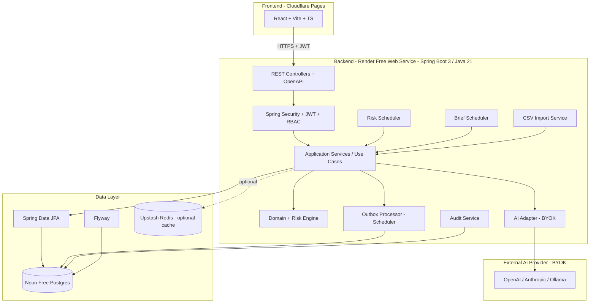
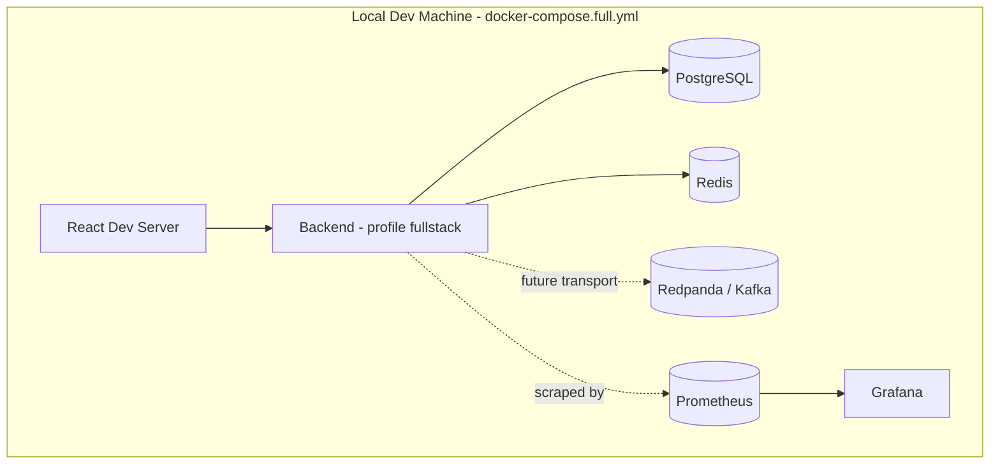
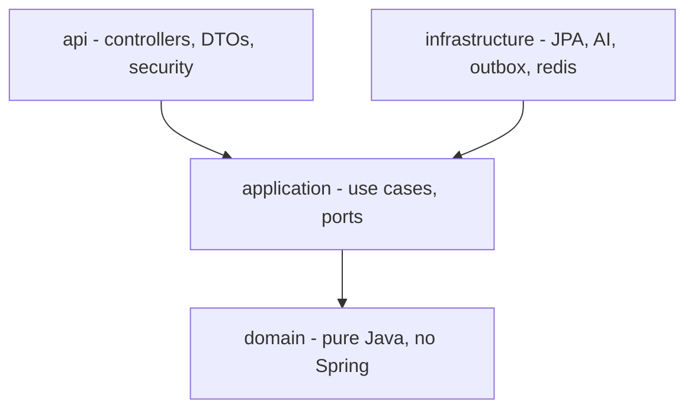
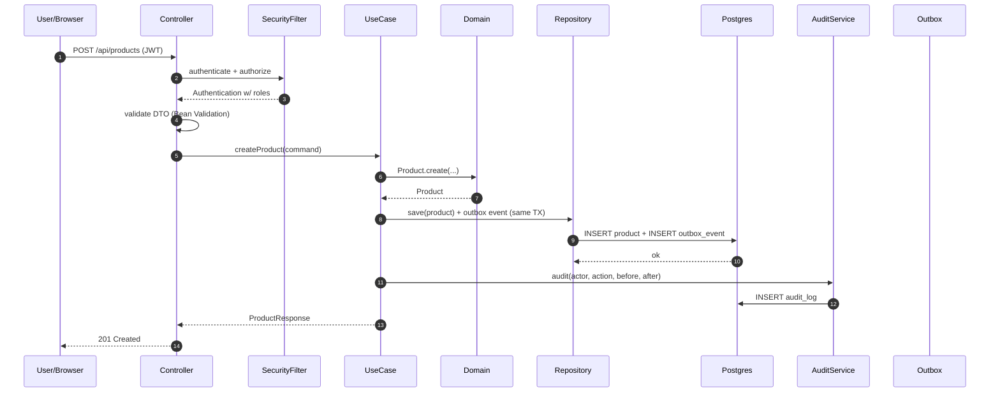
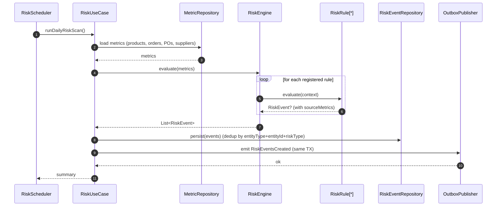
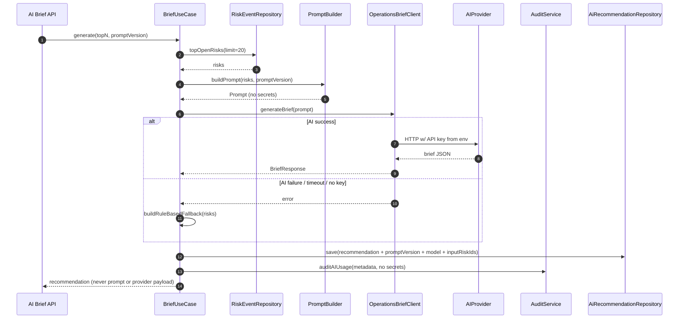
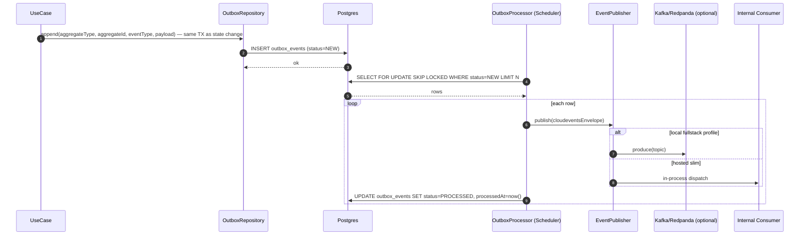
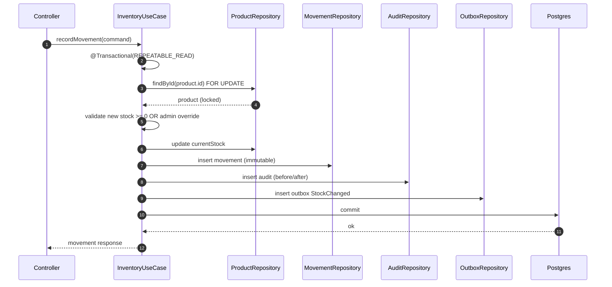
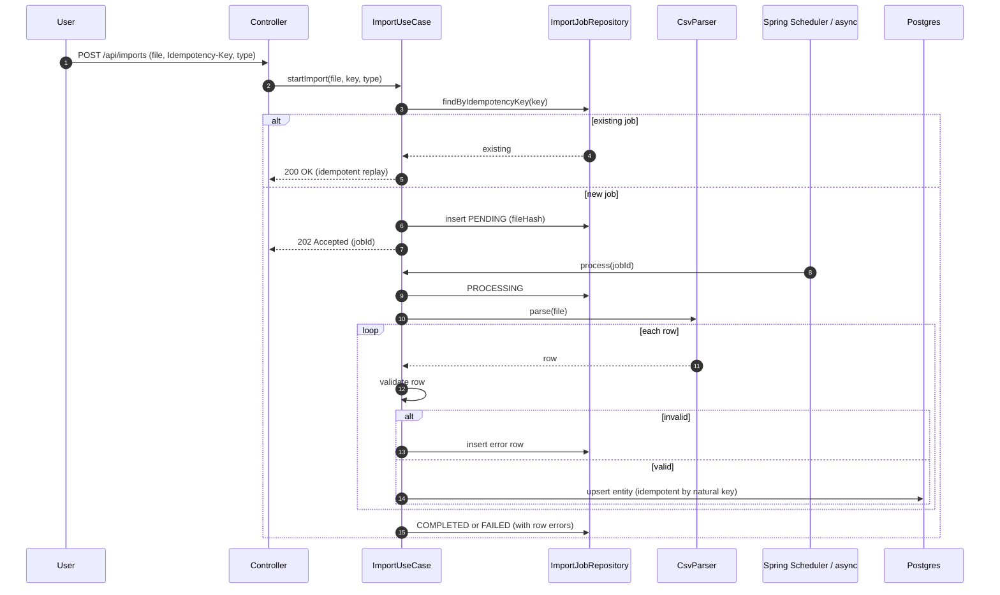

# OpsPulse-AI — Architecture

> Status: Phase 6 implemented locally
> Last updated: 2026-07-17
> Companion: [PRD.md](PRD.md), [DATA_MODEL.md](DATA_MODEL.md), [API_CONTRACT.md](API_CONTRACT.md), [ADR/](ADR/)

## 1. Architecture Overview & Principles

OpsPulse-AI is a **modular monolith** built with **hexagonal (ports & adapters)** architecture. It runs in two profiles:

- **Hosted slim** — single Spring Boot service + PostgreSQL (Neon) + optional Redis (Upstash). No Kafka, no Prometheus/Grafana in production. Uses PostgreSQL outbox for event publication.
- **Local full stack** — adds Kafka/Redpanda, Prometheus, Grafana, and Redis via `docker-compose.full.yml` for development & demo of observability and streaming skills.

### 1.1 Principles

1. **Domain first** — domain module has zero dependencies on frameworks, DB, or AI SDKs.
2. **Deterministic before AI** — risk events are computed by auditable rules; AI only consumes structured risk output.
3. **Ports & adapters** — each feature's application layer defines inbound use-case ports and outbound gateway ports; infrastructure implements outbound ports (JPA, AI client, outbox publisher). Domain code remains pure Java.
4. **No premature microservices** — modules communicate in-process; outbox makes future extraction cheap.
5. **Free-tier aware** — design fits within 512MB RAM and idle-suspending compute.
6. **Fail-safe AI** — AI failure degrades to rule-based brief; core operations never depend on AI.
7. **No secrets in flow** — API keys live only in env vars and the AI adapter; never logged, echoed, or persisted.

### 1.2 Module Map

| Module | Responsibility | Key ports |
|---|---|---|
| `auth` | Login, JWT issue/verify, refresh, RBAC enforcement | `Authenticator`, `TokenService` |
| `user` | User CRUD, role assignment | `UserRepository` |
| `product` | Product aggregate, risk participation | `ProductRepository` |
| `supplier` | Supplier aggregate, reliability stats | `SupplierRepository`, `SupplierReliabilityCalculator` |
| `order` | Customer order + items, delay detection | `OrderRepository`, `OrderDelayDetector` |
| `inventory` | Stock movement, transactional stock update, audit | `InventoryService`, `StockMovementRepository` |
| `purchaseorder` | PO + items, receiving, supplier delivery stats | `PurchaseOrderRepository` |
| `riskengine` | Rule registry, risk event creation, scheduler | `RiskRule`, `RiskEngine`, `RiskEventRepository` |
| `ai` | Provider-agnostic brief generation, prompt versioning, fallback | `OperationsBriefClient`, `PromptBuilder`, `BriefService` |
| `report` | Aggregate JSON reports | `ReportService` |
| `import` | CSV import jobs, idempotency, row validation | `ImportService`, `CsvParser` |
| `audit` | Audit log writer + reader | `AuditService` |
| `outbox` | Outbox table, scheduler poller, CloudEvents envelope, optional Kafka publisher | `OutboxRepository`, `OutboxProcessor`, `EventPublisher` |
| `dashboard` | Read-model aggregate queries | `DashboardQueryService` |
| `observability` | Correlation ID filter, metrics, structured logging | cross-cutting |

## 2. Hosted Slim Architecture



### 2.1 Free-tier sizing constraints

- Backend target RSS: **< 512MB**. JVM args: `-XX:MaxRAMPercentage=75 -XX:+UseSerialGC -XX:MaxDirectMemorySize=32m` (single-CPU free-tier friendly).
- Cold start mitigation: keep boot path lean (lazy JPA scanning, no heavy auto-config).
- Neon: use pooled connection string; rely on scale-to-zero for idle.
- Upstash Redis: optional; only enabled if `spring.profiles.active=prod` AND `UPSTASH_REDIS_URL` set.

## 3. Local Full Stack Architecture



Local full stack demonstrates:
- Redpanda infrastructure alongside the durable in-process outbox; Kafka publication remains a later transport milestone.
- Prometheus scraping `/actuator/prometheus`.
- Grafana dashboards (JVM, risk generation, outbox lag, AI latency).
- Redis caching for hot dashboard queries.

## 4. Module Boundaries & Dependency Rules



The arrows point **toward the component being depended on**: API and infrastructure depend on application; application depends on domain. Application code never imports infrastructure or API types.

### 4.1 Layering rules

- `domain` — pure Java, no Spring annotations, no JPA annotations, no Jackson. Contains aggregates, entities, value objects, domain services, and domain events.
- `application` — use cases orchestrate domain + inbound/outbound ports. Spring `@Service` is allowed here. No JPA entities or infrastructure imports.
- `infrastructure` — adapters: JPA entities + repositories, AI client impls, outbox publisher, Redis cache.
- `api` — `@RestController`, DTOs, request validation, security config.
- `shared` — configuration, security, error handling, observability, and persistence utilities that do not contain feature business rules.

Cross-feature synchronous workflows call another feature's **inbound application port**. Outbox events are reserved for asynchronous side effects and integration boundaries, not as a substitute for ordinary in-process calls.

### 4.2 Package layout

One Gradle module produces one Spring Boot deployable. Package boundaries provide modularity for the MVP:

```
com.opspulse
├── identity
│   ├── domain
│   ├── application
│   │   └── port (inbound and outbound)
│   ├── api
│   └── infrastructure
├── product
├── supplier
├── order
├── inventory
├── purchaseorder
├── risk
├── ai
├── report
├── importjob
├── audit
├── outbox
├── dashboard
└── shared
    ├── config
    ├── security
    ├── observability
    ├── error
    └── persistence
```

Every feature repeats `domain`, `application`, `api`, and `infrastructure` only when needed. Architecture tests enforce that domain/application packages do not depend on API or infrastructure packages.

## 5. Request Flow



## 6. Risk Calculation Flow



### 6.1 Rule registry

Rules implement `RiskRule`:
```
interface RiskRule {
  RiskType type();
  Optional<RiskEvent> evaluate(RiskContext ctx);
}
```
Rules are Spring beans discovered at startup. New rule = new bean, no core flow change (NFR-2).

Phase 3 keeps one active event per generated dedup key. A scan refreshes active
evidence, system-resolves cleared conditions, and emits a new historical event
when a terminal condition recurs. Risk thresholds are loaded from typed scalar
`app_config` values.

### 6.2 Severity mapping

| Severity | Heuristic |
|---|---|
| LOW | Trigger within 2x threshold window |
| MEDIUM | Trigger within 1.5x threshold |
| HIGH | Trigger at threshold |
| CRITICAL | Trigger past threshold + secondary signal (e.g., stockout + active order consuming the SKU) |

## 7. AI Recommendation Flow



### 7.1 AI safety policies

- Timeout: 15s per call. Retry: 1 retry with 2s backoff (no retry on 4xx).
- API key: read once from env at adapter construction; never logged; never returned in DTO.
- Prompt version: stored in `prompt_versions` table; `BriefRequest.promptVersion` immutable.
- Fallback: rule-based template renders top risks + recommended actions deterministically and returns `200 OK` when no key is configured or validation fails.
- V10 persists prompt versions, recommendations, risk links, and sanitized usage metadata; `opspulse.brief.generated` is written atomically to the outbox.
- All AI responses marked `generatedBy: AI` and include `riskEventIds` and `sourceMetrics` reference.

## 8. Outbox Flow



### 8.1 Retry & poison messages

- On exception: `retryCount++`, `errorMessage=...`, `status=RETRY` if `retryCount < 5`, else `DEAD`.
- Exponential backoff: 1s, 2s, 4s, 8s, 16s.
- Dead messages require manual intervention (admin endpoint to replay or discard).

### 8.2 Idempotency

- Consumers dedupe by `event.id` (CloudEvents id) and `aggregateId + eventType` combination.
- Outbox `payload.id` is the CloudEvents id; consumers persist processed IDs in `processed_events` table.
- The hosted Phase 3 consumer registry is a durable acknowledgement boundary;
  unknown event types retry and become `DEAD` after five attempts. ADMIN users
  may replay or discard dead rows without exposing payload data.

## 9. Inventory Transactional Consistency Flow



### 9.1 Concurrency model

- Pessimistic lock on `products` row during movement (single-CPU free-tier rarely contends; lock window is microseconds).
- Optimistic version column on `products` for non-movement updates (UI save).
- Negative stock: blocked unless `allowNegativeStock` admin config true.

## 10. CSV Import Flow



Phase 6 uses `V11__import_jobs_row_errors.sql`. Uploads are retained as
bounded in-memory bytes for the asynchronous handoff; the database stores the
file hash, idempotency key, status/counts, and bounded row errors. Valid rows
reuse the existing product, supplier, order, inventory, and purchase-order
application ports so audit and transactional outbox behavior stays consistent.
The report service uses batched JDBC aggregates and exposes five read-only
JSON views; report request counters and latency timers are emitted through
Micrometer.

## 11. Cross-Cutting Concerns

| Concern | Implementation |
|---|---|
| Logging | SLF4J + Logback JSON encoder; MDC `requestId`, `userId`. |
| Correlation ID | `CorrelationIdFilter` reads `X-Request-Id` or generates UUID; propagates to logs + audit. |
| Error envelope | `@RestControllerAdvice` → `{ code, message, fields, requestId, timestamp }`. |
| OpenAPI | `springdoc-openapi-starter-webmvc-ui`; spec at `/v3/api-docs`; UI at `/swagger-ui.html`. |
| Actuator | `/actuator/health`, `/actuator/info`, `/actuator/prometheus`, `/actuator/metrics`. |
| Phase 6 metrics | `opspulse.import.started/completed/failed/rows` and `opspulse.report.requests/duration`. |
| Phase 7 observability | Optional `docker-compose.full.yml` runs Prometheus, Grafana, and Redpanda; the provisioned dashboard covers JVM, risk scan, outbox, AI, import, and report metrics. Prometheus is public only in the local `fullstack` profile. |
| Security | JWT stateless filter chain; BCrypt password encoder; refresh-token family rotation with replay revocation; method-level `@PreAuthorize`. |
| Validation | Bean Validation on DTOs; service-layer invariants on domain. |
| Caching | Spring Cache abstraction; Redis adapter optional; default in-memory Caffeine on hosted slim. |

## 12. AI Provider-Agnostic Adapter Contract

```
// ai/application/port/out/OperationsBriefClient (outbound port)
interface OperationsBriefClient {
  BriefResponse generate(BriefRequest req) throws AiClientException;
}

// infrastructure/ai/springai/SpringAiBriefClient (adapter)
//   - reads API key from env
//   - implements timeout + retry
//   - logs sanitized metadata only

// infrastructure/ai/fallback/RuleBasedBriefClient (adapter)
//   - deterministic summary from risk events
//   - used when primary client fails or key absent
```

`BriefRequest` carries: `promptVersion`, `risks` (with sourceMetrics + ids), `tenantContext`, `locale`. `BriefResponse` carries: `summary`, `actions`, `messageDrafts`, `confidence`, `modelProviderName`, `promptVersion`. Neither carries API keys.

## 13. Spring Profiles

| Profile | Use | Notes |
|---|---|---|
| `local` | Minimal local dev | Postgres + backend via `docker-compose.yml`. |
| `test` | Testcontainers | JPA + integration tests; ephemeral Postgres. |
| `prod` | Hosted slim | Neon + optional Upstash; no Kafka. |
| `fullstack` | Local full stack | Adds Redpanda/Redis infrastructure plus Prometheus/Grafana scraping; Kafka publication remains deferred. |

## 14. Cross-Module Event Catalog

[ADR-006](ADR/ADR-006-use-cloudevents-compatible-outbox-envelope.md#event-type-catalog-initial) is the canonical event catalog and payload contract. Architecture does not duplicate that list so the two documents cannot drift.

All events use the CloudEvents 1.0 envelope. MVP implementation creates only events required by an active in-process consumer or an explicit audit/integration requirement; the remaining catalog entries are reserved contracts for later phases.

## 15. Deferred Architecture Decisions

1. SSE/outbox-tail delivery is deferred beyond MVP; hosted clients use lightweight polling.
2. `RuleBasedBriefClient` is a separate adapter selected by the application service when the primary AI adapter is absent or fails.
3. A dedicated dashboard projection table is deferred; JPA/SQL DTO projections are sufficient for the MVP dataset.

## 16. References

- [PRD.md](PRD.md)
- [DATA_MODEL.md](DATA_MODEL.md)
- [API_CONTRACT.md](API_CONTRACT.md)
- [ADR/](ADR/)
- [DEPLOYMENT.md](DEPLOYMENT.md)
