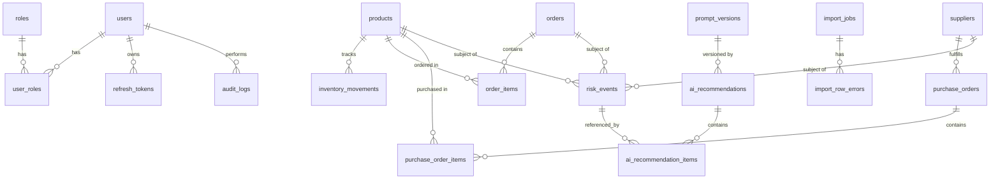
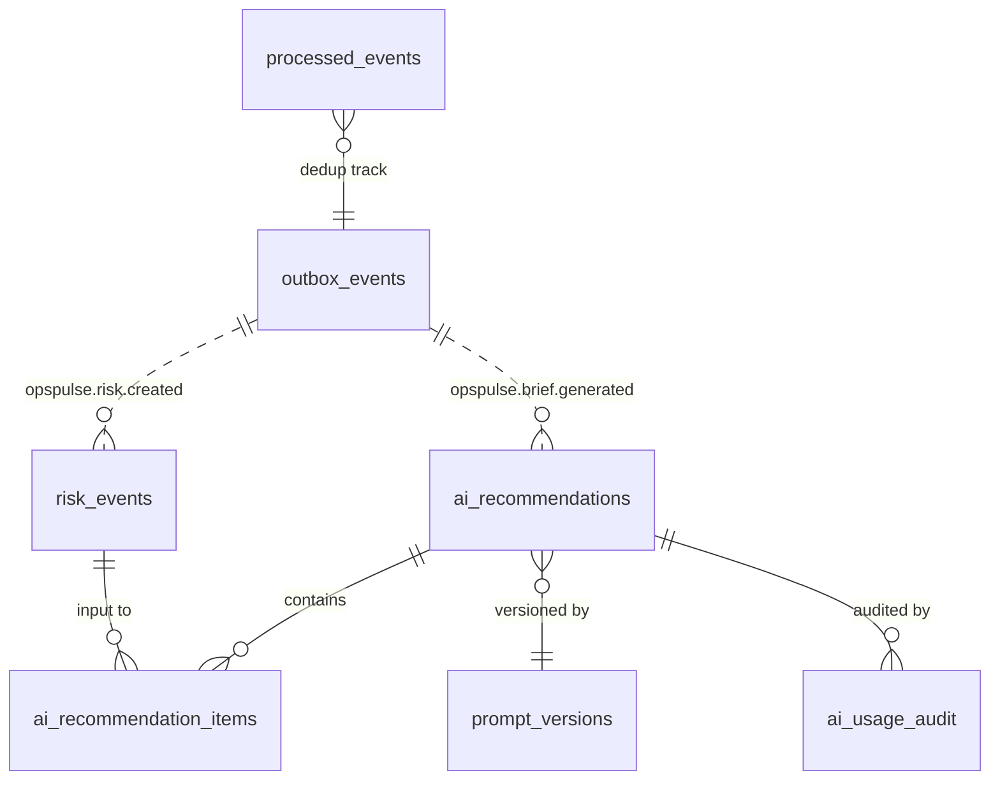

# OpsPulse-AI — Data Model

> Status: Draft v0.1
> Last updated: 2026-07-10
> Companion: [ARCHITECTURE.md](ARCHITECTURE.md), [API_CONTRACT.md](API_CONTRACT.md)

## 1. Entity List (by module)

| Module | Tables |
|---|---|
| auth/user | `users`, `roles`, `user_roles`, `refresh_tokens` |
| product | `products` |
| supplier | `suppliers` |
| order | `orders`, `order_items` |
| inventory | `inventory_movements` |
| purchaseorder | `purchase_orders`, `purchase_order_items` |
| riskengine | `risk_events` |
| ai | `ai_recommendations`, `ai_recommendation_items`, `prompt_versions`, `ai_usage_audit` |
| import | `import_jobs`, `import_row_errors` |
| audit | `audit_logs` |
| outbox | `outbox_events`, `processed_events` |
| config | `app_config` |

## 2. Table Designs

### 2.1 `users`
| Column | Type | Constraints | Notes |
|---|---|---|---|
| `id` | UUID | PK | |
| `email` | CITEXT | UNIQUE NOT NULL | case-insensitive |
| `password_hash` | VARCHAR(255) | NOT NULL | BCrypt |
| `full_name` | VARCHAR(120) | NOT NULL | |
| `active` | BOOLEAN | NOT NULL DEFAULT true | |
| `organization_id` | UUID | NULL | multi-tenant placeholder |
| `created_at` | TIMESTAMPTZ | NOT NULL DEFAULT now() | |
| `created_by` | UUID | NULL | self on register |
| `updated_at` | TIMESTAMPTZ | NOT NULL DEFAULT now() | |
| `updated_by` | UUID | NULL | |
| `version` | BIGINT | NOT NULL DEFAULT 0 | optimistic lock |

### 2.2 `roles` / `user_roles`
- `roles`: `id UUID PK`, `name VARCHAR(32) UNIQUE` (ADMIN/MANAGER/OPERATOR/VIEWER).
- `user_roles`: `user_id UUID FK`, `role_id UUID FK`, PK(`user_id`,`role_id`).

### 2.3 `refresh_tokens`
| Column | Type | Notes |
|---|---|---|
| `id` | UUID PK | |
| `user_id` | UUID FK | |
| `token_hash` | VARCHAR(255) NOT NULL | hash of refresh token |
| `expires_at` | TIMESTAMPTZ NOT NULL | |
| `revoked_at` | TIMESTAMPTZ NULL | |
| `created_at` | TIMESTAMPTZ NOT NULL DEFAULT now() |
| Index: `idx_refresh_tokens_token_hash` (lookup), `idx_refresh_tokens_user_expires` (cleanup). |

### 2.4 `products`
| Column | Type | Constraints | Notes |
|---|---|---|---|
| `id` | UUID | PK | |
| `sku` | VARCHAR(64) | UNIQUE NOT NULL | natural key |
| `name` | VARCHAR(200) | NOT NULL | |
| `category` | VARCHAR(80) | NULL | |
| `unit` | VARCHAR(20) | NOT NULL DEFAULT 'PCS' | |
| `current_stock` | NUMERIC(18,3) | NOT NULL DEFAULT 0 | |
| `safety_stock` | NUMERIC(18,3) | NOT NULL DEFAULT 0 | |
| `reorder_point` | NUMERIC(18,3) | NOT NULL DEFAULT 0 | |
| `cost` | NUMERIC(18,4) | NOT NULL DEFAULT 0 | |
| `selling_price` | NUMERIC(18,4) | NOT NULL DEFAULT 0 | |
| `active` | BOOLEAN | NOT NULL DEFAULT true | |
| `organization_id` | UUID | NULL | placeholder |
| `created_at`, `created_by`, `updated_at`, `updated_by`, `version` | standard | | |

### 2.5 `suppliers`
| Column | Type | Notes |
|---|---|---|
| `id` UUID PK | | |
| `name` VARCHAR(200) NOT NULL | | |
| `contact_info` JSONB NULL | email, phone, address |
| `average_lead_time_days` NUMERIC(6,2) NULL | rolling avg from POs |
| `expected_sla_days` INTEGER NOT NULL | |
| `active` BOOLEAN NOT NULL DEFAULT true | |
| `organization_id` UUID NULL | |
| `created_at`, `created_by`, `updated_at`, `updated_by`, `version` standard | | |

### 2.6 `orders` / `order_items`
`orders`:
| Column | Type | Notes |
|---|---|---|
| `id` UUID PK | | |
| `order_number` VARCHAR(64) UNIQUE NOT NULL | natural key |
| `customer_name` VARCHAR(200) NOT NULL | |
| `status` VARCHAR(16) NOT NULL CHECK in (NEW, CONFIRMED, PICKING, SHIPPED, DELAYED, CANCELLED) | |
| `expected_ship_date` DATE NOT NULL | |
| `actual_ship_date` DATE NULL | |
| `total_amount` NUMERIC(18,4) NOT NULL DEFAULT 0 | |
| `organization_id` UUID NULL | |
| `created_at`, `created_by`, `updated_at`, `updated_by`, `version` standard | | |

`order_items`:
| Column | Type | Notes |
|---|---|---|
| `id` UUID PK | | |
| `order_id` UUID FK ON DELETE CASCADE | |
| `product_id` UUID FK | |
| `quantity` NUMERIC(18,3) NOT NULL CHECK > 0 | |
| `unit_price` NUMERIC(18,4) NOT NULL | |
| `line_total` NUMERIC(18,4) GENERATED ALWAYS AS (quantity * unit_price) STORED | |

### 2.7 `inventory_movements`
| Column | Type | Notes |
|---|---|---|
| `id` UUID PK | |
| `product_id` UUID FK NOT NULL | |
| `movement_type` VARCHAR(16) NOT NULL CHECK in (INBOUND, OUTBOUND, ADJUSTMENT, RETURN) | |
| `quantity` NUMERIC(18,3) NOT NULL | signed: +in, -out |
| `balance_after` NUMERIC(18,3) NOT NULL | snapshot |
| `reason` VARCHAR(200) NULL | |
| `reference_type` VARCHAR(40) NULL | order/po/manual |
| `reference_id` UUID NULL | |
| `created_at` TIMESTAMPTZ NOT NULL DEFAULT now() | |
| `created_by` UUID NOT NULL | |
| `request_id` VARCHAR(64) NULL | correlation |

> Immutable: no UPDATE/DELETE on rows. Enforced via revoked grants + application logic.

### 2.8 `purchase_orders` / `purchase_order_items`
`purchase_orders`:
| Column | Type | Notes |
|---|---|---|
| `id` UUID PK | |
| `po_number` VARCHAR(64) UNIQUE NOT NULL | |
| `supplier_id` UUID FK NOT NULL | |
| `status` VARCHAR(20) NOT NULL CHECK in (DRAFT, SENT, PARTIALLY_RECEIVED, RECEIVED, DELAYED, CANCELLED) | |
| `expected_delivery_date` DATE NOT NULL | |
| `actual_delivery_date` DATE NULL | |
| `organization_id` UUID NULL | |
| `created_at`, `created_by`, `updated_at`, `updated_by`, `version` standard | |

`purchase_order_items`:
| Column | Type | Notes |
|---|---|---|
| `id` UUID PK | |
| `purchase_order_id` UUID FK CASCADE | |
| `product_id` UUID FK | |
| `quantity` NUMERIC(18,3) NOT NULL CHECK > 0 | |
| `unit_cost` NUMERIC(18,4) NOT NULL | |
| `received_quantity` NUMERIC(18,3) NOT NULL DEFAULT 0 | |

### 2.9 `risk_events`
| Column | Type | Notes |
|---|---|---|
| `id` UUID PK | |
| `risk_type` VARCHAR(32) NOT NULL CHECK in (STOCKOUT_RISK, OVERSTOCK_RISK, SLOW_MOVING_INVENTORY, ORDER_DELAY_RISK, SUPPLIER_DELAY_RISK, LOW_MARGIN_RISK) | |
| `severity` VARCHAR(12) NOT NULL CHECK in (LOW, MEDIUM, HIGH, CRITICAL) | |
| `entity_type` VARCHAR(32) NOT NULL | uppercase enum: PRODUCT/ORDER/SUPPLIER/PURCHASE_ORDER |
| `entity_id` UUID NOT NULL | |
| `source_metrics` JSONB NOT NULL | deterministic inputs |
| `explanation` TEXT NOT NULL | |
| `recommended_action` TEXT NOT NULL | |
| `status` VARCHAR(16) NOT NULL DEFAULT 'OPEN' CHECK in (OPEN, ACKNOWLEDGED, RESOLVED, DISMISSED) | |
| `created_at` TIMESTAMPTZ NOT NULL DEFAULT now() | |
| `resolved_at` TIMESTAMPTZ NULL | |
| `resolved_by` UUID NULL | |
| `organization_id` UUID NULL | |
| `dedup_key` VARCHAR(128) GENERATED ALWAYS AS (risk_type || ':' || entity_type || ':' || entity_id::text) STORED | |

### 2.10 `ai_recommendations` / `ai_recommendation_items`
`ai_recommendations`:
| Column | Type | Notes |
|---|---|---|
| `id` UUID PK | |
| `prompt_version` VARCHAR(32) NOT NULL | FK to prompt_versions.version |
| `model_provider_name` VARCHAR(64) NOT NULL | e.g. openai/gpt-4o-mini |
| `generated_by` VARCHAR(16) NOT NULL CHECK in (AI, RULE_BASED) | explicit response provenance |
| `generated_summary` TEXT NOT NULL | |
| `generated_actions` JSONB NOT NULL | array of action objects |
| `generated_message_drafts` JSONB NOT NULL | supplier/customer drafts |
| `confidence` NUMERIC(4,3) NULL | |
| `status` VARCHAR(16) NOT NULL DEFAULT 'GENERATED' CHECK in (GENERATED, APPROVED, REJECTED, ARCHIVED) | |
| `user_feedback` TEXT NULL | |
| `created_at` TIMESTAMPTZ NOT NULL DEFAULT now() | |
| `created_by` UUID NULL | null for scheduled/system generation |
| `created_by_type` VARCHAR(16) NOT NULL DEFAULT 'USER' CHECK in (USER, SYSTEM) | actor provenance |
| `organization_id` UUID NULL | |

`ai_recommendation_items` (links brief to risk events):
| Column | Type | Notes |
|---|---|---|
| `id` UUID PK | |
| `recommendation_id` UUID FK CASCADE | |
| `risk_event_id` UUID FK | |
| `role` VARCHAR(32) NOT NULL | top5/secondary |

### 2.11 `prompt_versions`
| Column | Type | Notes |
|---|---|---|
| `version` VARCHAR(32) PK | semver e.g. `1.0.0` |
| `template` TEXT NOT NULL | prompt template |
| `description` TEXT NULL | |
| `active` BOOLEAN NOT NULL DEFAULT true | |
| `created_at` TIMESTAMPTZ NOT NULL DEFAULT now() | |

### 2.12 `ai_usage_audit`
| Column | Type | Notes |
|---|---|---|
| `id` UUID PK | |
| `recommendation_id` UUID FK | |
| `provider` VARCHAR(64) NOT NULL | |
| `model` VARCHAR(64) NOT NULL | |
| `prompt_version` VARCHAR(32) NOT NULL | |
| `input_token_count` INTEGER NULL | |
| `output_token_count` INTEGER NULL | |
| `latency_ms` INTEGER NULL | |
| `success` BOOLEAN NOT NULL | |
| `error_class` VARCHAR(120) NULL | sanitized; no key |
| `request_id` VARCHAR(64) NULL | |
| `created_at` TIMESTAMPTZ NOT NULL DEFAULT now() | |

### 2.13 `import_jobs` / `import_row_errors`
`import_jobs`:
| Column | Type | Notes |
|---|---|---|
| `id` UUID PK | |
| `idempotency_key` VARCHAR(128) UNIQUE NOT NULL | |
| `file_hash` VARCHAR(64) NOT NULL | sha-256; duplicate scope includes organization + import type |
| `import_type` VARCHAR(32) NOT NULL | products/suppliers/orders/inventory/po |
| `organization_id` UUID NULL | multi-tenant placeholder; part of duplicate-content scope |
| `status` VARCHAR(16) NOT NULL CHECK in (PENDING, PROCESSING, COMPLETED, FAILED) | |
| `total_rows` INTEGER NULL | |
| `success_rows` INTEGER NULL | |
| `error_rows` INTEGER NULL | |
| `started_at` TIMESTAMPTZ NULL | |
| `finished_at` TIMESTAMPTZ NULL | |
| `created_at` TIMESTAMPTZ NOT NULL DEFAULT now() | |
| `created_by` UUID NOT NULL | |

`import_row_errors`:
| Column | Type | Notes |
|---|---|---|
| `id` UUID PK | |
| `import_job_id` UUID FK CASCADE | |
| `row_number` INTEGER NOT NULL | |
| `raw_row` TEXT NOT NULL | |
| `error_code` VARCHAR(64) NOT NULL | |
| `error_message` TEXT NOT NULL | |
| `created_at` TIMESTAMPTZ NOT NULL DEFAULT now() | |

### 2.14 `audit_logs`
| Column | Type | Notes |
|---|---|---|
| `id` UUID PK | |
| `actor_user_id` UUID NULL | null for system |
| `action` VARCHAR(64) NOT NULL | e.g. product.update |
| `entity_type` VARCHAR(32) NOT NULL | |
| `entity_id` UUID NULL | |
| `before_snapshot` JSONB NULL | |
| `after_snapshot` JSONB NULL | |
| `request_id` VARCHAR(64) NULL | |
| `ip_address` VARCHAR(64) NULL | |
| `created_at` TIMESTAMPTZ NOT NULL DEFAULT now() | |

### 2.15 `outbox_events`
| Column | Type | Notes |
|---|---|---|
| `id` UUID PK | |
| `aggregate_type` VARCHAR(32) NOT NULL | |
| `aggregate_id` UUID NOT NULL | |
| `event_type` VARCHAR(64) NOT NULL | e.g. opspulse.product.created |
| `payload` JSONB NOT NULL | CloudEvents 1.0 envelope |
| `status` VARCHAR(12) NOT NULL DEFAULT 'NEW' CHECK in (NEW, RETRY, PROCESSED, DEAD) | |
| `retry_count` INTEGER NOT NULL DEFAULT 0 | |
| `next_attempt_at` TIMESTAMPTZ NOT NULL DEFAULT now() | |
| `error_message` TEXT NULL | |
| `created_at` TIMESTAMPTZ NOT NULL DEFAULT now() | |
| `processed_at` TIMESTAMPTZ NULL | |

### 2.16 `processed_events`
| Column | Type | Notes |
|---|---|---|
| `event_id` UUID PK | CloudEvents id (outbox payload.id) |
| `processed_at` TIMESTAMPTZ NOT NULL DEFAULT now() | |

### 2.17 `app_config`
| Column | Type | Notes |
|---|---|---|
| `key` VARCHAR(64) PK | |
| `value` JSONB NOT NULL | |
| `updated_at` TIMESTAMPTZ NOT NULL DEFAULT now() | |
| `updated_by` UUID NULL | |

Holds: `allowNegativeStock`, `slowMovingDays`, `excessiveDaysThreshold`, `lowMarginThresholdPct`, `lateDeliveryRateThreshold`, `riskScanCron`, `briefCron`.

## 3. Important Indexes

| Index | Table | Columns | Purpose |
|---|---|---|---|
| `idx_users_email_lower` | users | lower(email) | login lookup |
| `idx_products_sku` | products | sku (unique) | natural key |
| `idx_products_active_category` | products | (active, category) | dashboard filter |
| `idx_orders_status_shipdate` | orders | (status, expected_ship_date) | delay detection |
| `idx_order_items_order` | order_items | order_id | order detail |
| `idx_movements_product_created` | inventory_movements | (product_id, created_at DESC) | movement history |
| `idx_po_supplier_status` | purchase_orders | (supplier_id, status) | supplier stats |
| `idx_po_items_po` | purchase_order_items | purchase_order_id | po detail |
| `idx_risk_status_severity_created` | risk_events | (status, severity, created_at DESC) | dashboard top risks |
| `idx_risk_dedup` | risk_events | (dedup_key, status) | dedup + open lookup |
| `idx_risk_entity` | risk_events | (entity_type, entity_id) | entity risk lookup |
| `idx_audit_entity_created` | audit_logs | (entity_type, entity_id, created_at DESC) | entity history |
| `idx_audit_actor_created` | audit_logs | (actor_user_id, created_at DESC) | user activity |
| `idx_outbox_status_next` | outbox_events | (status, next_attempt_at) WHERE status IN (NEW, RETRY) | poller |
| `idx_import_jobs_key` | import_jobs | idempotency_key (unique) | idempotency |
| `idx_import_jobs_content` | import_jobs | UNIQUE NULLS NOT DISTINCT (organization_id, import_type, file_hash) | duplicate-content detection in single-tenant and future multi-tenant modes |
| `idx_recommendations_created` | ai_recommendations | (created_at DESC) | brief list |

## 4. Relationships & Cardinalities



## 5. Referential Integrity & Cascade Policy

- `order_items.order_id` → `orders.id` `ON DELETE CASCADE`.
- `purchase_order_items.purchase_order_id` → `purchase_orders.id` `ON DELETE CASCADE`.
- `inventory_movements.product_id` → `products.id` `ON DELETE RESTRICT` (never delete a product with movements; use `active=false`).
- `risk_events.entity_id` → no FK (polymorphic); enforced in service layer by entity existence check.
- `ai_recommendation_items.risk_event_id` → `risk_events.id` `ON DELETE SET NULL` (preserve brief even if risk dismissed).
- `audit_logs.entity_id` → no FK (polymorphic, point-in-time).

## 6. Audit Columns Convention

Every mutable table includes:
- `created_at TIMESTAMPTZ NOT NULL DEFAULT now()`
- `created_by UUID NULL`
- `updated_at TIMESTAMPTZ NOT NULL DEFAULT now()` (updated via JPA `@PreUpdate`)
- `updated_by UUID NULL`
- `version BIGINT NOT NULL DEFAULT 0` (JPA `@Version` optimistic lock)

Immutable tables use only the provenance columns relevant to their writer:
- `inventory_movements` has `created_at` and `created_by`.
- `audit_logs` has `created_at` and `actor_user_id`.
- `import_row_errors`, `outbox_events`, and `ai_usage_audit` have `created_at`.
- `processed_events` has `processed_at`.

## 7. Outbox CloudEvents Schema

```json
{
  "specversion": "1.0",
  "id": "550e8400-e29b-41d4-a716-446655440000",
  "source": "/opspulse/products",
  "type": "opspulse.product.stock.changed",
  "subject": "product/550e8400-...",
  "time": "2026-07-10T01:30:00Z",
  "datacontenttype": "application/json",
  "data": {
    "productId": "...",
    "delta": -5,
    "newStock": 42,
    "reason": "order/ORD-1001"
  }
}
```

`outbox_events.payload` stores this envelope verbatim. `outbox_events.id` is the DB row id; `payload.id` is the CloudEvents id used for consumer dedup.

## 8. ER Diagram (full schema)

```mermaid
erDiagram
    users {
        uuid id PK
        citext email
        varchar password_hash
        varchar full_name
        boolean active
        uuid organization_id
        timestamptz created_at
        uuid created_by
        timestamptz updated_at
        uuid updated_by
        bigint version
    }
    products {
        uuid id PK
        varchar sku
        varchar name
        varchar category
        varchar unit
        numeric current_stock
        numeric safety_stock
        numeric reorder_point
        numeric cost
        numeric selling_price
        boolean active
        uuid organization_id
        bigint version
    }
    suppliers {
        uuid id PK
        varchar name
        jsonb contact_info
        numeric average_lead_time_days
        integer expected_sla_days
        boolean active
    }
    orders {
        uuid id PK
        varchar order_number
        varchar customer_name
        varchar status
        date expected_ship_date
        date actual_ship_date
        numeric total_amount
    }
    order_items {
        uuid id PK
        uuid order_id FK
        uuid product_id FK
        numeric quantity
        numeric unit_price
        numeric line_total
    }
    inventory_movements {
        uuid id PK
        uuid product_id FK
        varchar movement_type
        numeric quantity
        numeric balance_after
        varchar reason
        varchar reference_type
        uuid reference_id
        timestamptz created_at
        uuid created_by
    }
    purchase_orders {
        uuid id PK
        varchar po_number
        uuid supplier_id FK
        varchar status
        date expected_delivery_date
        date actual_delivery_date
    }
    purchase_order_items {
        uuid id PK
        uuid purchase_order_id FK
        uuid product_id FK
        numeric quantity
        numeric unit_cost
        numeric received_quantity
    }
    risk_events {
        uuid id PK
        varchar risk_type
        varchar severity
        varchar entity_type
        uuid entity_id
        jsonb source_metrics
        text explanation
        text recommended_action
        varchar status
        timestamptz created_at
        timestamptz resolved_at
        varchar dedup_key
    }
    ai_recommendations {
        uuid id PK
        varchar prompt_version
        varchar model_provider_name
        text generated_summary
        jsonb generated_actions
        jsonb generated_message_drafts
        numeric confidence
        varchar status
        timestamptz created_at
    }
    outbox_events {
        uuid id PK
        varchar aggregate_type
        uuid aggregate_id
        varchar event_type
        jsonb payload
        varchar status
        integer retry_count
        timestamptz next_attempt_at
        text error_message
        timestamptz created_at
        timestamptz processed_at
    }
    audit_logs {
        uuid id PK
        uuid actor_user_id
        varchar action
        varchar entity_type
        uuid entity_id
        jsonb before_snapshot
        jsonb after_snapshot
        varchar request_id
        timestamptz created_at
    }
    import_jobs {
        uuid id PK
        varchar idempotency_key
        varchar file_hash
        varchar import_type
        varchar status
        integer total_rows
        integer success_rows
        integer error_rows
    }
```



## 9. Outbox + Risk + AI Cluster (focused)



## 10. Flyway Migration Strategy

### 10.1 Naming convention

```
db/migration/
├── V1__init_auth_user.sql
├── V2__products_suppliers.sql
├── V3__orders_order_items.sql
├── V4__inventory_movements.sql
├── V5__purchase_orders_items.sql
├── V6__risk_events.sql
├── V7__ai_recommendations_prompt_versions.sql
├── V8__audit_logs.sql
├── V9__outbox_events_processed_events.sql
├── V10__import_jobs_row_errors.sql
├── V11__app_config.sql
├── V12__supplemental_indexes.sql
└── repeatable
    └── R__seed_demo_data.sql
```

### 10.2 Rules

- Each migration is **forward-only**; never edit applied migrations.
- Schema-changing migrations are versioned `V<n>__name.sql`.
- Seed/demo data is repeatable `R__seed_demo_data.sql` (re-applied when checksum changes) — gated by Spring profile `local`/`test`.
- `prod` profile does NOT seed demo data.
- Each `V<n>` migration is wrapped in a transaction (Postgres DDL is transactional).
- Every table migration creates the critical indexes required by that table's first consumer. `V12__supplemental_indexes.sql` is reserved for measured, non-blocking optimizations found later.
- Indexes that may lock writes are created `CONCURRENTLY` where supported; otherwise applied during a maintenance window (acceptable for the portfolio demo).

### 10.3 Demo seed plan

`R__seed_demo_data.sql` inserts:
- 1 admin, 1 manager, 2 operators, 1 viewer (passwords via test hash, documented in README).
- 30 products across 5 categories.
- 8 suppliers with varied lead times.
- 60 orders spanning statuses (mix of NEW, PICKING, SHIPPED, DELAYED).
- 20 purchase orders with realistic delivery performance (3 late suppliers).
- ~200 inventory movements.
- Trigger risk engine + AI brief on first run.

## 11. Migration Strategy for Future Multi-Tenant

- All tables include nullable `organization_id UUID`.
- MVP enforces single-tenant (set to a default org or null).
- Phase 8+ adds `organizations` table and migrates nulls to default org; partitions queries by `organization_id` for tenant isolation.
- Flyway `V20__organizations.sql` (placeholder) will introduce the table and backfill.

## 12. Data Retention & Cleanup

| Table | Retention | Strategy |
|---|---|---|
| `audit_logs` | indefinite (portfolio) | none |
| `inventory_movements` | indefinite | none (immutable) |
| `outbox_events` | 30 days after `PROCESSED` | scheduled cleanup job |
| `processed_events` | 30 days | scheduled cleanup |
| `import_row_errors` | 90 days | scheduled cleanup |
| `ai_usage_audit` | indefinite | none |
| `refresh_tokens` | until expiry + 7d | scheduled cleanup |

## 13. References

- [ARCHITECTURE.md](ARCHITECTURE.md)
- [ADR-002 — Outbox](ADR/ADR-002-use-postgresql-outbox-in-hosted-demo.md)
- [ADR-006 — CloudEvents](ADR/ADR-006-use-cloudevents-compatible-outbox-envelope.md)
- [API_CONTRACT.md](API_CONTRACT.md)
