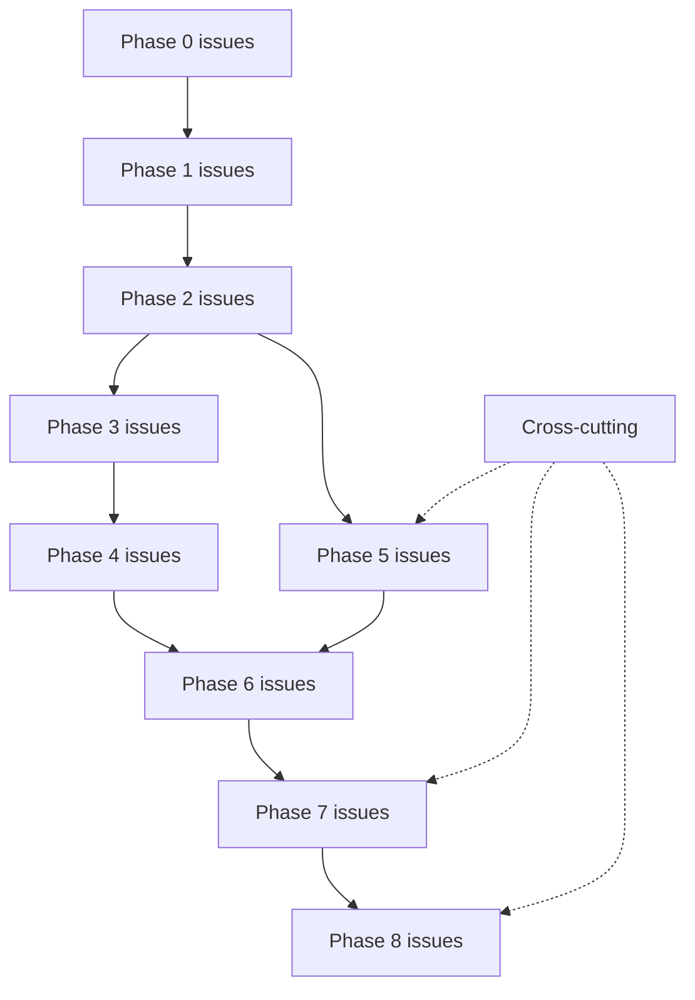

# OpsPulse-AI — Initial GitHub Issues Plan

> Status: Draft v0.1
> Last updated: 2026-07-10
> Companion: [ROADMAP.md](ROADMAP.md), [PRD.md](PRD.md), [ARCHITECTURE.md](ARCHITECTURE.md)

This document is a **planning artifact**. Actual GitHub issues are created by the maintainer (via `gh issue create` or the GitHub UI) using the breakdown below as a template.

## 1. Label Taxonomy

### 1.1 Component labels
`backend`, `frontend`, `database`, `ai`, `docs`, `infra`, `tests`, `deployment`, `portfolio`, `security`, `observability`

### 1.2 Phase labels
`phase-0`, `phase-1`, `phase-2`, `phase-3`, `phase-4`, `phase-5`, `phase-6`, `phase-7`, `phase-8`

### 1.3 Size labels
`size:S` (≤ 1 day), `size:M` (1–3 days), `size:L` (> 3 days)

### 1.4 Type labels (optional)
`feature`, `bug`, `chore`, `spike`, `security`, `observability`

## 2. Milestones (mapped to ROADMAP phases)

| Milestone | Roadmap phase |
|---|---|
| `M0 — Scaffolding` | Phase 0 |
| `M1 — Backend Foundation` | Phase 1 |
| `M2 — Core Domain CRUD` | Phase 2 |
| `M3 — Risk Engine` | Phase 3 |
| `M4 — AI Recommendations` | Phase 4 |
| `M5 — Frontend` | Phase 5 |
| `M6 — Import & Reports` | Phase 6 |
| `M7 — Tests/Obs/Deploy` | Phase 7 |
| `M8 — Portfolio Polish` | Phase 8 |

## 3. Issue Breakdown

### Phase 0 — Scaffolding (M0)

| # | Title | Labels | Size | Acceptance criteria | Dependencies |
|---|---|---|---|---|---|
| P0-1 | Initialize single-module Gradle Kotlin DSL build + Spring Boot 3 + Java 21 toolchain | `infra`, `backend`, `phase-0` | M | `./gradlew build` green; toolchain pinned to Java 21; one executable Spring Boot JAR; no application subprojects | – |
| P0-2 | Author multi-stage Dockerfile (JRE 21 slim) + .dockerignore | `infra`, `deployment`, `phase-0` | M | Image < 250MB; `docker run` boots app | P0-1 |
| P0-3 | Create `docker-compose.yml` (Postgres + backend, profile `local`) | `infra`, `database`, `phase-0` | S | `docker compose up` → `/actuator/health` 200 | P0-2 |
| P0-5 | Configure Spring profiles (`local`, `test`, `prod`, `fullstack`) | `backend`, `infra`, `phase-0` | S | Profile-specific `application-*.yml`; default profile `local` | P0-1 |
| P0-6 | GitHub Actions CI: build + test on push | `infra`, `tests`, `phase-0` | S | CI green on trivial test; cache Gradle deps | P0-1 |
| P0-7 | README stub + `.gitignore` + `.editorconfig` + `CONTRIBUTING.md` stub | `docs`, `phase-0` | S | Repo has minimal README; secrets ignored | – |
| P0-8 | Set up feature-first package layout and architecture tests per ARCHITECTURE.md §4.2 | `backend`, `tests`, `phase-0` | M | Feature packages contain only required `domain/application/api/infrastructure` layers; tests prevent application/domain from importing adapters | P0-1 |

### Phase 1 — Backend Foundation (M1)

| # | Title | Labels | Size | Acceptance criteria | Dependencies |
|---|---|---|---|---|---|
| P1-1 | Implement Spring Security + JWT filter chain | `backend`, `security`, `phase-1` | L | Login/refresh/logout work; 401 on bad token | P0-8 |
| P1-2 | Implement RBAC for 4 roles via `@PreAuthorize` | `backend`, `security`, `phase-1` | M | Role matrix enforced; 403 on wrong role | P1-1 |
| P1-3 | Flyway V1 init auth/user + V8 audit_logs | `database`, `backend`, `phase-1` | M | Migrations and their critical lookup/audit indexes apply on startup; tables exist | P0-5 |
| P1-4 | BCrypt password encoder + refresh token rotation | `backend`, `security`, `phase-1` | M | Passwords hashed; refresh tokens rotate on use; revoked on logout | P1-1, P1-3 |
| P1-5 | Global error envelope + `@RestControllerAdvice` | `backend`, `phase-1` | S | All errors return `{code,message,fields,requestId,timestamp}` | P0-8 |
| P1-6 | Correlation ID filter + MDC structured JSON logging | `backend`, `observability`, `phase-1` | S | `requestId` in every log line; propagated to audit | P0-8 |
| P1-7 | Actuator: health/info/prometheus endpoints | `backend`, `observability`, `phase-1` | S | `/actuator/health` 200; prometheus exposes JVM metrics | P0-1 |
| P1-8 | springdoc-openapi with bearer-jwt security scheme | `backend`, `docs`, `phase-1` | M | `/v3/api-docs` + `/swagger-ui.html` work; endpoints documented | P0-8 |
| P1-9 | Audit service base (writer + reader) | `backend`, `phase-1` | M | `AuditService.log(actor, action, entity, before, after)` persists | P1-3 |
| P1-10 | Integration test harness with Testcontainers | `tests`, `backend`, `phase-1` | M | `@SpringBootTest` + Testcontainers Postgres; one sample test green | P0-3 |

### Phase 2 — Core Domain CRUD (M2)

| # | Title | Labels | Size | Acceptance criteria | Dependencies |
|---|---|---|---|---|---|
| P2-1 | Flyway V2 products + supplier migrations + entities/repositories | `database`, `backend`, `phase-2` | M | CRUD endpoints pass integration tests | P1-3 |
| P2-2 | Flyway V3 orders + order_items; CRUD + status transitions | `database`, `backend`, `phase-2` | L | All 6 statuses reachable via PATCH; audit logged | P1-3 |
| P2-3 | Flyway V4 inventory_movements; transactional stock update | `database`, `backend`, `phase-2` | L | Stock update + movement + audit + outbox in one TX; negative blocked | P2-1 |
| P2-4 | Flyway V5 purchase_orders + items; receive endpoint | `database`, `backend`, `phase-2` | L | Receiving PO updates stock + supplier stats | P2-1, P2-3 |
| P2-5 | Flyway V9 outbox_events + processed_events; OutboxPublisher (write side) | `database`, `backend`, `phase-2` | M | Outbox row and `idx_outbox_status_next` are created; row inserts in same TX as state change | P1-3 |
| P2-6 | CloudEvents envelope builder + unit tests | `backend`, `phase-2` | M | Envelope has all 8 required fields; fixtures per event type | P2-5 |
| P2-7 | Audit integration on all CRUD operations | `backend`, `phase-2` | M | Every write produces audit row with before/after | P1-9, P2-1..4 |
| P2-8 | Pagination/filter/sort utilities + DTO projections | `backend`, `phase-2` | M | All list endpoints support page/size/sort/filter | P2-1..4 |
| P2-9 | Integration tests for all CRUD endpoints | `tests`, `backend`, `phase-2` | L | Happy + error paths covered; RBAC enforced | P2-1..4 |

### Phase 3 — Risk Engine (M3)

| # | Title | Labels | Size | Acceptance criteria | Dependencies |
|---|---|---|---|---|---|
| P3-1 | Flyway V6 risk_events migration | `database`, `backend`, `phase-3` | S | Table + critical status/dedup/entity indexes exist; dedup_key generated | P1-3 |
| P3-1A | Flyway V11 app_config migration + typed configuration access | `database`, `backend`, `phase-3` | M | Default risk thresholds and scheduler settings are persisted and readable without hardcoded rule values | P1-3 |
| P3-2 | `RiskRule` interface + Spring bean registry | `backend`, `ai`, `phase-3` | M | Rules discovered at startup; new bean = new rule | P2-1 |
| P3-3 | `MetricRepository` for pre-computed aggregates (avg daily sales 7d/30d, late delivery rate) | `backend`, `phase-3` | L | Aggregates correct on demo data; no N+1 | P2-1..4 |
| P3-4 | StockoutRiskRule + OverstockRiskRule + unit tests | `backend`, `ai`, `tests`, `phase-3` | M | Rules produce expected RiskEvent on fixtures | P3-2, P3-3 |
| P3-5 | SlowMovingRiskRule + OrderDelayRiskRule + unit tests | `backend`, `ai`, `tests`, `phase-3` | M | Rules produce expected RiskEvent on fixtures | P3-2, P3-3 |
| P3-6 | SupplierDelayRiskRule + LowMarginRiskRule + unit tests | `backend`, `ai`, `tests`, `phase-3` | M | Rules produce expected RiskEvent on fixtures | P3-2, P3-3 |
| P3-7 | `RiskScheduler` Spring `@Scheduled` job (cron from `app_config`) | `backend`, `phase-3` | M | Daily scan produces risk events on demo data | P3-1A, P3-4..6 |
| P3-8 | `OutboxProcessor` poller: `SELECT FOR UPDATE SKIP LOCKED` + retry/backoff + DEAD | `backend`, `phase-3` | L | NEW → PROCESSED within interval; DEAD after 5 retries | P2-5 |
| P3-9 | Idempotent in-process consumers + `processed_events` dedup | `backend`, `phase-3` | M | Replay same CloudEvents id → no double-apply | P3-8 |
| P3-10 | Risk endpoints: list, get, scan, acknowledge, resolve, dismiss | `backend`, `phase-3` | M | Endpoints match API_CONTRACT.md §6.8 | P3-1, P3-7 |
| P3-11 | Integration test: end-to-end scan → events → outbox | `tests`, `backend`, `phase-3` | M | Green on demo dataset | P3-7, P3-8 |

### Phase 4 — AI Recommendations (M4)

| # | Title | Labels | Size | Acceptance criteria | Dependencies |
|---|---|---|---|---|---|
| P4-1 | Flyway V7 ai_recommendations + items + prompt_versions + ai_usage_audit | `database`, `backend`, `ai`, `phase-4` | M | Tables + indexes exist | P1-3 |
| P4-2 | `OperationsBriefClient` outbound application port + `BriefRequest`/`BriefResponse` value objects | `backend`, `ai`, `phase-4` | S | Port lives under `ai.application.port.out`; no Spring AI types leak into application/domain | P3-1 |
| P4-3 | `SpringAiBriefClient` adapter with `@ConditionalOnProperty(AI_API_KEY)` | `backend`, `ai`, `phase-4` | L | Bean only when key set; structured output → BriefResponse | P4-2 |
| P4-4 | `RuleBasedBriefClient` fallback adapter | `backend`, `ai`, `phase-4` | M | Deterministic brief from risk events; same shape as AI | P4-2 |
| P4-5 | `PromptBuilder` reading `prompt_versions.template` | `backend`, `ai`, `phase-4` | M | Prompt built from active version; no secrets in prompt | P4-1 |
| P4-6 | `BriefService` use case: load risks → build → call → parse → persist → audit | `backend`, `ai`, `phase-4` | L | End-to-end works; AI failure → fallback | P4-3, P4-4, P4-5 |
| P4-7 | Timeout (15s) + 1 retry on 5xx; no retry on 4xx | `backend`, `ai`, `phase-4` | S | WireMock test verifies policy | P4-3 |
| P4-8 | Response parser: validate `riskEventIds` exist; reject hallucinations | `backend`, `ai`, `security`, `phase-4` | M | Mocked bad response → fallback | P4-6 |
| P4-9 | AI usage audit (sanitized, no secrets) | `backend`, `ai`, `observability`, `phase-4` | S | `ai_usage_audit` row per call; no key in any field | P4-6 |
| P4-10 | Endpoints: generate, list, get, approve, reject, feedback | `backend`, `ai`, `phase-4` | M | Endpoints match API_CONTRACT.md §6.9 | P4-6 |
| P4-11 | Static grep test: no `AI_API_KEY` value in logs | `tests`, `security`, `ai`, `phase-4` | S | CI fails on leakage | P4-9 |
| P4-12 | Hallucination guard integration test | `tests`, `ai`, `phase-4` | M | Bad AI response → fallback brief 200 | P4-8 |

### Phase 5 — Frontend (M5)

| # | Title | Labels | Size | Acceptance criteria | Dependencies |
|---|---|---|---|---|---|
| P5-1 | Vite + React + TypeScript + Tailwind scaffold | `frontend`, `phase-5` | S | `npm run dev` boots; `npm run build` produces `dist/` | – |
| P5-2 | Typed API client from OpenAPI (or hand-written) | `frontend`, `phase-5` | M | Client covers auth + all endpoints; types match backend | P1-8 |
| P5-3 | Auth context + JWT storage + role-based route guards | `frontend`, `phase-5` | M | Login flow works; routes guarded by role | P5-2 |
| P5-4 | Login page | `frontend`, `phase-5` | S | Loading/error/empty states; 401 shown | P5-3 |
| P5-5 | Dashboard page (all widgets) | `frontend`, `portfolio`, `phase-5` | L | All `/api/dashboard` widgets render; < 1.5s on demo | P5-2 |
| P5-6 | Products + Suppliers pages (list + CRUD) | `frontend`, `phase-5` | L | Pagination/filter/sort; CRUD forms; RBAC UI | P5-2 |
| P5-7 | Orders + Purchase Orders pages | `frontend`, `phase-5` | L | Status transitions; receive PO action | P5-2 |
| P5-8 | Risk events page (filter by type/severity, acknowledge/resolve) | `frontend`, `phase-5` | M | Filter + actions work; RBAC UI | P5-2 |
| P5-9 | AI daily brief page (AI vs RULE_BASED labelling) | `frontend`, `ai`, `portfolio`, `phase-5` | M | Brief rendered; generatedBy label visible | P5-2 |
| P5-10 | Reports page (5 reports) | `frontend`, `phase-5` | M | JSON tables render; loading/error states | P5-2 |
| P5-11 | Import demo data page (file upload + job status) | `frontend`, `phase-5` | M | Multipart upload; polling job status; row errors | P5-2 |
| P5-12 | Admin/users page (optional) | `frontend`, `phase-5` | M | ADMIN only; CRUD users + roles | P5-2 |
| P5-13 | Cloudflare Pages build config + env vars | `deployment`, `frontend`, `phase-5` | S | Build succeeds; preview URL works | P5-1 |

### Phase 6 — Import & Reports (M6)

| # | Title | Labels | Size | Acceptance criteria | Dependencies |
|---|---|---|---|---|---|
| P6-1 | Flyway V10 import_jobs + import_row_errors | `database`, `backend`, `phase-6` | S | Tables exist | P1-3 |
| P6-2 | CSV parser (Apache Commons CSV) | `backend`, `phase-6` | S | Parses all 5 file types; encoding handled | – |
| P6-3 | Import service: idempotency + file hash + row validation + async | `backend`, `phase-6` | L | Idempotent replay; row errors returned; job status transitions | P6-1, P6-2 |
| P6-4 | Import endpoints (POST, GET list, GET id, GET errors) | `backend`, `phase-6` | M | Endpoints match API_CONTRACT.md §6.11 | P6-3 |
| P6-5 | Report: daily ops brief | `backend`, `phase-6` | S | Returns latest brief JSON | P4-10 |
| P6-6 | Report: inventory risk | `backend`, `phase-6` | M | Aggregates correct on demo data | P3-10 |
| P6-7 | Report: supplier SLA | `backend`, `phase-6` | M | Aggregates correct on demo data | P2-4 |
| P6-8 | Report: order delay | `backend`, `phase-6` | M | Aggregates correct on demo data | P2-2 |
| P6-9 | Report: product margin/risk | `backend`, `phase-6` | M | Aggregates correct on demo data | P3-10 |
| P6-10 | Frontend import page wiring | `frontend`, `phase-6` | S | Polling + error display work | P5-11, P6-4 |
| P6-11 | Frontend reports page wiring | `frontend`, `phase-6` | S | All 5 reports render | P5-10, P6-5..9 |

### Phase 7 — Tests/Obs/Deploy (M7)

| # | Title | Labels | Size | Acceptance criteria | Dependencies |
|---|---|---|---|---|---|
| P7-1 | Testcontainers integration suite for all critical API flows | `tests`, `backend`, `phase-7` | L | Suite green in CI; covers auth, CRUD, risk, brief, import | P1-10 |
| P7-2 | Unit test coverage >= 80% on domain/risk/AI prompt/CloudEvents | `tests`, `backend`, `ai`, `phase-7` | M | JaCoCo report in CI; threshold enforced | P3-11, P4-12 |
| P7-3 | Local full stack: Redpanda + Redis + Prometheus + Grafana dashboards | `infra`, `observability`, `phase-7` | L | `docker-compose.full.yml` is optional/local-only and Grafana shows JVM + risk + outbox + AI latency dashboards | P0-3 |
| P7-4 | Dockerfile slim image verification on Render | `deployment`, `infra`, `phase-7` | M | Image < 250MB; boot < 25s; RSS < 512MB | P0-2 |
| P7-5 | Render Free deployment + env vars + health check | `deployment`, `infra`, `phase-7` | M | Live URL; `/actuator/health` 200 within 90s cold | P7-4 |
| P7-6 | Neon Free Postgres project + Flyway release stage | `deployment`, `database`, `phase-7` | M | Migrations applied; demo data seeded | P1-3 |
| P7-7 | Cloudflare Pages production deploy | `deployment`, `frontend`, `phase-7` | S | Production URL live; CORS allowlist set | P5-13 |
| P7-8 | Optional Upstash Redis cache for dashboard | `backend`, `deployment`, `phase-7` | S | Dashboard < 1.5s warm; cache hit ratio > 80% | P5-5 |
| P7-9 | Keep-alive ping (cron-job.org or GitHub Actions) every 12 min | `deployment`, `infra`, `phase-7` | S | Service never sleeps > 15 min; logs show pings | P7-5 |
| P7-10 | Smoke test script (health + login + dashboard + brief) | `tests`, `deployment`, `phase-7` | S | Script exits 0 on healthy demo | P7-5, P7-7 |
| P7-11 | Free-tier platform validation checklist run | `deployment`, `docs`, `phase-7` | S | DEPLOYMENT.md §10 all rows "Verified" | P7-5..7 |
| P7-12 | Security review (JWT, CORS, secret hygiene, RBAC) | `security`, `tests`, `phase-7` | M | Checklist passed; no findings high/critical | P1-2, P4-11 |

### Phase 8 — Portfolio Polish (M8)

| # | Title | Labels | Size | Acceptance criteria | Dependencies |
|---|---|---|---|---|---|
| P8-1 | README complete (business-impact framing + diagrams + demo links) | `docs`, `portfolio`, `phase-8` | M | Reviewer 5-min test passes | P7-10 |
| P8-2 | Screenshots / GIFs (login, dashboard, risk, AI brief, import) | `portfolio`, `docs`, `phase-8` | M | ≥3 images embedded in README | P7-10 |
| P8-3 | Demo credentials + sample data documented | `docs`, `portfolio`, `phase-8` | S | Credentials in README; clearly demo-only | P7-6 |
| P8-4 | Known limitations + future improvements sections | `docs`, `portfolio`, `phase-8` | S | README sections complete | P7-11 |
| P8-5 | Hosted vs Local explanation section | `docs`, `portfolio`, `phase-8` | S | Side-by-side table in README | P7-3, P7-5 |
| P8-6 | Blog post / write-up summarizing ADRs | `docs`, `portfolio`, `phase-8` | M | Linked from README | ADR/* |
| P8-7 | Loom / GIF walkthrough | `portfolio`, `phase-8` | M | 2–3 min walkthrough linked in README | P8-2 |
| P8-8 | Cross-link all 10 planning docs | `docs`, `phase-8` | S | All docs reference each other | all |
| P8-9 | Final smoke test on hosted demo | `tests`, `deployment`, `phase-8` | S | All flows green on production URL | P7-10 |

## 4. Cross-Cutting Issues

| # | Title | Labels | Notes |
|---|---|---|---|
| CC-1 | Performance pass: dashboard < 1.5s; no N+1; indexes verified | `backend`, `tests` | After Phase 5 |
| CC-2 | Observability pass: structured logs + correlation + metrics dashboards | `observability`, `backend` | After Phase 7 |
| CC-3 | Security hardening: OWASP top 10 review + dependency scan | `security`, `tests` | After Phase 7 |
| CC-4 | Documentation pass: ADRs + API_CONTRACT + DEPLOYMENT final review | `docs` | After Phase 8 |
| CC-5 | Free-tier quarterly re-verification | `deployment`, `infra` | Recurring |

## 5. Suggested First 5 Issues to Start With

1. **P0-1** — Initialize single-module Gradle Kotlin DSL build + Spring Boot 3 + Java 21 (`infra`, `backend`, `phase-0`, `size:M`).
2. **P0-8** — Establish feature-first package boundaries and architecture tests (`backend`, `tests`, `phase-0`, `size:M`).
3. **P0-5** — Configure local/test/prod/fullstack profiles (`backend`, `infra`, `phase-0`, `size:S`).
4. **P0-2 + P0-3** — Author the multi-stage Dockerfile and minimal local Compose (`infra`, `deployment`, `phase-0`, `size:M`).
5. **P0-6** — Add GitHub Actions build/test quality gate (`infra`, `tests`, `phase-0`, `size:S`).

## 6. Issue Dependency Graph (phase-level)

## 7. References

- [ROADMAP.md](ROADMAP.md)
- [PRD.md](PRD.md)
- [ARCHITECTURE.md](ARCHITECTURE.md)
- [API_CONTRACT.md](API_CONTRACT.md)
- [RISK_REGISTER.md](RISK_REGISTER.md)
- [DEPLOYMENT.md](DEPLOYMENT.md)
