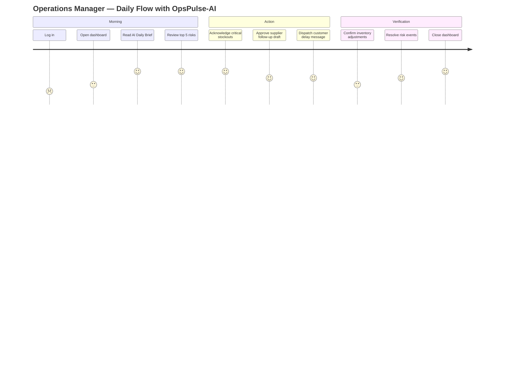

# OpsPulse-AI — Product Requirements Document (PRD)

> Status: Draft v0.1 — planning phase
> Owner: Portfolio project (single contributor)
> Last updated: 2026-07-10

## 1. Product Overview

**OpsPulse-AI** is an operations intelligence platform for small and medium enterprises (SMEs) that sell, distribute, or warehouse physical goods. It ingests inventory, order, supplier, and purchase-order data, runs a deterministic **risk engine**, and produces an **AI-assisted daily operations brief** with prioritized actions and ready-to-send message drafts.

The product is **deterministic-first, AI-second**. AI never invents business metrics — it consumes structured risk events produced by auditable business rules. AI failure degrades gracefully to a rule-based summary without breaking core operations.

The project is also a **portfolio artifact** demonstrating Java backend, data engineering, AI integration, and system design skills within a hard free-tier deployment constraint.

### 1.1 Vision Statement

> "Every SME operations manager should start the day with a 60-second brief that tells them exactly what to fix, who to call, and why — without opening a spreadsheet."

## 2. Target Users

| Persona | Role in product | Primary pain |
|---|---|---|
| **SME owner** | `ADMIN` | No visibility into stockouts, dead stock, or supplier reliability; relies on instinct. |
| **Operations manager** | `MANAGER` | Spends first hour manually triaging orders and suppliers in Excel. |
| **Inventory planner** | `MANAGER` / `OPERATOR` | Cannot easily identify slow-moving or overstocked SKUs. |
| **Warehouse / admin staff** | `OPERATOR` | Manual stock adjustments with no audit trail. |
| **Supplier coordinator** | `OPERATOR` | No prioritized list of which suppliers to follow up with today. |

### 2.1 Manager Daily Journey (target state)

## 3. Business Goals & Success Metrics

### 3.1 Business Impact Goals

1. Reduce **stockout incidents** on the demo dataset by surfacing risk before stock hits zero.
2. Reduce **dead stock / slow-moving inventory** holding cost via visibility.
3. Reduce **order delays** by prioritizing at-risk orders.
4. Improve **supplier follow-up** quality with reliability ranking and message drafts.
5. Replace **manual Excel triage** with a 60-second AI brief.
6. Demonstrate end-to-end engineering capability (backend, data, AI, system design, deployment).

### 3.2 Success Metrics (demo-scoped)

| Metric | Target | Measurement |
|---|---|---|
| Dashboard load (demo dataset) | < 1.5s | Actuator + manual timing |
| CRUD response (normal) | < 500ms | API tests |
| Risk engine coverage | 6 risk types active | Unit test count |
| AI brief latency (BYOK) | < 8s p95 target; 15s hard timeout per attempt | Actuator metrics |
| AI fallback success | 100% of AI failures produce rule-based brief | Integration test |
| Backend memory (hosted) | < 512MB RSS | Render metrics / Actuator |
| Unit test coverage on domain | >= 80% | JaCoCo |
| Free-tier cost | $0 / month | Deployment audit |

## 4. Functional Requirements

### FR-1 Authentication & Authorization
- Register/login with email + password.
- JWT access tokens; refresh token rotation.
- Roles: `ADMIN`, `MANAGER`, `OPERATOR`, `VIEWER`.
- RBAC matrix enforced on every endpoint.
- Passwords stored with BCrypt — never plaintext.
- Failed/successful login audit logged.

### FR-2 Product Management
- CRUD for products.
- Fields: `sku` (unique), `name`, `category`, `unit`, `currentStock`, `safetyStock`, `reorderPoint`, `cost`, `sellingPrice`, `active`.
- SKU uniqueness enforced at DB + service layer.
- Product participates in inventory risk calculation.

### FR-3 Supplier Management
- CRUD for suppliers.
- Fields: `name`, `contactInfo`, `averageLeadTimeDays`, `expectedSlaDays`, `active`.
- Reliability derived from PO delivery history (late delivery rate, average lead time variance).

### FR-4 Order Management
- Create / import / update customer orders.
- Order: `orderNumber`, `customerName`, `status`, `expectedShipDate`, `actualShipDate`, `totalAmount`.
- Order item: `product`, `quantity`, `unitPrice`.
- Statuses: `NEW`, `CONFIRMED`, `PICKING`, `SHIPPED`, `DELAYED`, `CANCELLED`.
- At-risk order detection (expected ship date near/past, not shipped).
- Orders are retained for audit; use `CANCELLED` rather than deleting an order after creation.

### FR-5 Inventory Movement
- Movement types: `INBOUND`, `OUTBOUND`, `ADJUSTMENT`, `RETURN`.
- Every stock change creates an immutable movement record.
- Current stock updated transactionally with movement insert.
- Negative stock blocked unless admin config explicitly allows.

### FR-6 Purchase Order Management
- CRUD for POs to suppliers.
- PO: `poNumber`, `supplier`, `expectedDeliveryDate`, `actualDeliveryDate`, `status`.
- PO item: `product`, `quantity`, `unitCost`.
- Statuses: `DRAFT`, `SENT`, `PARTIALLY_RECEIVED`, `RECEIVED`, `DELAYED`, `CANCELLED`.
- Receiving a PO updates product stock and supplier delivery stats.
- `OPERATOR` may create and edit `DRAFT` POs and receive goods. Only `MANAGER` or `ADMIN` may send, delay, cancel, or otherwise transition a PO after draft.
- Purchase orders are retained for audit; use `CANCELLED` rather than deleting them.

### FR-7 Risk Engine
Deterministic rules first. Required risk types:

| Risk type | Trigger (illustrative) |
|---|---|
| `STOCKOUT_RISK` | `currentStock < avgDailySales7d * supplierLeadTimeDays` |
| `OVERSTOCK_RISK` | `currentStock > avgDailySales30d * excessiveDaysThreshold` |
| `SLOW_MOVING_INVENTORY` | stock > 0 and no movement for N days |
| `ORDER_DELAY_RISK` | `expectedShipDate` near/past and status != `SHIPPED` |
| `SUPPLIER_DELAY_RISK` | supplier `lateDeliveryRate` > threshold |
| `LOW_MARGIN_RISK` | `sellingPrice - cost` below threshold or margin % below target |

Risk event fields: `riskType`, `severity` (LOW/MEDIUM/HIGH/CRITICAL), `entityType`, `entityId`, `sourceMetrics` (JSON), `explanation`, `recommendedAction`, `status` (OPEN/ACKNOWLEDGED/RESOLVED/DISMISSED), `createdAt`, `resolvedAt`.

### FR-8 AI Daily Operations Brief
- Input = structured risk events + source metrics (never raw ad-hoc metrics).
- Output: executive summary, top 5 risks, recommended actions, supplier follow-up drafts, customer delay drafts (when relevant), confidence/explanation referencing source metrics and risk event IDs.
- Stored fields: `id`, `promptVersion`, `modelProviderName`, `generatedBy` (AI/RULE_BASED), linked `inputRiskEventIds`, `generatedSummary`, `generatedActions`, `generatedMessageDrafts`, `status` (GENERATED/APPROVED/REJECTED/ARCHIVED), `userFeedback`, `createdAt`.

### FR-9 AI Safety & Reliability
- Prompt version persisted.
- AI request metadata persisted without secrets.
- Rule-based fallback brief on AI failure or missing key.
- API key never in logs, frontend, or response payload.
- Timeout + retry policy; clear error handling.
- AI output marked as AI-generated.
- AI recommendations reference `riskEventIds` + `sourceMetrics`.

### FR-10 Dashboard
Aggregates: total products, total open orders, delayed orders count, high-risk products count, open risk events count, supplier reliability ranking, top stockout risks, slow-moving list, daily AI brief, recent inventory movements, recent risk events.

### FR-11 Reports
JSON-first reports: Daily Ops Brief, Inventory Risk, Supplier SLA, Order Delay, Product Margin/Risk. PDF export is out of scope for MVP.

### FR-12 Data Import
CSV import for products, suppliers, orders, inventory movements, POs. Row-level validation errors, request replay via `Idempotency-Key`, and duplicate-content detection by `(organization, importType, fileHash)`. Import job status: `PENDING`, `PROCESSING`, `COMPLETED`, `FAILED`.

### FR-13 Audit Log
Audited actions: login success/failure, product create/update/deactivate, order create/update/status change, inventory adjustment, PO create/update/status change/receive, risk acknowledge/resolve/dismiss, AI recommendation approve/reject. Fields: `actorUserId`, `action`, `entityType`, `entityId`, `beforeSnapshot` (optional), `afterSnapshot` (optional), `timestamp`, `requestId`.

### FR-14 Outbox Pattern (hosted slim)
PostgreSQL `outbox_events` table instead of Kafka. CloudEvents-compatible envelope. Spring Scheduler poller processes and dispatches events. Future migration to Kafka/Redpanda without changing domain contracts. Optional Kafka publishing in local full-stack profile.

## 5. Non-Functional Requirements

| ID | Category | Requirement |
|---|---|---|
| NFR-1 | Performance | Hosted demo within free-tier RAM/CPU; backend < 512MB target; dashboard < 1.5s; CRUD < 500ms; pagination on lists; indexes on hot filters; no N+1; DTO projections where needed. |
| NFR-2 | Scalability | Outbox → Kafka migration path; domain services decoupled from infra; risk rules pluggable; AI provider swappable; frontend multi-tenant ready (placeholder `organizationId`). |
| NFR-3 | Reliability | TX for stock updates; idempotency for imports + outbox; safe retries; AI failure non-blocking; health endpoint; graceful error envelope. |
| NFR-4 | Security | JWT, password hashing, input validation, RBAC, no secrets in Git, BYOK env var only, CORS allowlist, least privilege, audit sensitive ops. |
| NFR-5 | Maintainability | Clean modules, consistent package naming, domain unit tests, integration tests with Testcontainers, Flyway migrations, ADRs, consistent DTO mapping. |
| NFR-6 | Observability | Actuator (health/info/prometheus), structured logs, correlation/request IDs, AI usage metadata, risk generation metrics, local Prometheus + Grafana. |
| NFR-7 | Testability | Unit tests for risk engine, stock calc, SLA calc, order delay, prompt builder, CloudEvents envelope; Testcontainers integration; deterministic seed data. |
| NFR-8 | Deployability | Dockerfile, `docker-compose.yml` (local), `docker-compose.full.yml` (full stack), deployment guide, Spring profiles (`local`, `test`, `prod`, `fullstack`). |
| NFR-9 | Cost | Deployable on long-term free services only; no short-lived trial dependency; verify platform free status before deploy; mark "requires manual verification" if unverifiable. |
| NFR-10 | Portfolio Quality | Business-impact README, architecture/ER/sequence diagrams, screenshots/GIFs, sample data, API docs, known limitations, future improvements, clear "Hosted vs Local" explanation. |

## 6. Out of Scope (MVP)

- Multi-tenant SaaS onboarding (schema placeholder only).
- Native mobile apps.
- PDF report export (JSON only).
- Real-time streaming beyond outbox polling / SSE.
- Payment / billing / invoicing integration.
- ERP integrations beyond CSV import.
- Barcode / scanner integration.
- Warehouse routing optimization.
- AI model fine-tuning or training.
- Public marketplace of risk rules (rules are code-configured).
- SSO / OAuth provider integration (local password auth only for MVP).

## 7. Success Metrics & Acceptance Criteria per Milestone

| Milestone | Acceptance criteria |
|---|---|
| Phase 0 — Scaffolding | Repo builds, CI green, Dockerfile produces image, `docker-compose up` boots Postgres + backend, health endpoint 200. |
| Phase 1 — Foundation | Login + JWT works for all 4 roles, RBAC blocks unauthorized, Flyway init applied, OpenAPI served at `/swagger-ui.html`, error envelope consistent. |
| Phase 2 — Core CRUD | All domain CRUD endpoints pass integration tests; inventory movement TX verified; audit log populated. |
| Phase 3 — Risk Engine | All 6 risk types have unit tests; scheduler produces risk events on demo data; outbox events emitted. |
| Phase 4 — AI Brief | BYOK brief generated; fallback works without key; prompt version persisted; no secret in logs. |
| Phase 5 — Frontend | All pages render with loading/empty/error states; RBAC-driven UI; dashboard < 1.5s on demo data. |
| Phase 6 — Import + Reports | CSV import idempotent; 5 report endpoints return correct aggregates. |
| Phase 7 — Tests/Obs/Deploy | Testcontainers suite green; Prometheus scraping; hosted demo live on free tier; smoke test passes. |
| Phase 8 — Portfolio Polish | README complete; screenshots; demo credentials; known limitations; hosted demo URL in README. |

## 8. Glossary

| Term | Definition |
|---|---|
| **SKU** | Stock Keeping Unit — unique product identifier. |
| **Safety stock** | Buffer stock held to mitigate demand/supply variability. |
| **Reorder point** | Stock level at which a replenishment order should be placed. |
| **Lead time** | Time from PO sent to goods received. |
| **SLA** | Service Level Agreement — expected delivery window for a supplier. |
| **Late delivery rate** | % of POs where `actualDeliveryDate > expectedDeliveryDate`. |
| **Outbox** | Pattern where domain events are written to a DB table in the same TX as state changes, then dispatched asynchronously. |
| **CloudEvents** | CNCF spec for describing event data in common formats. |
| **BYOK** | Bring Your Own Key — user supplies their own AI provider API key. |
| **Modular monolith** | Single deployable unit with internal module boundaries, ready for future extraction. |
| **Hexagonal architecture** | Ports & adapters — domain logic isolated from infrastructure. |
| **Rule-based fallback** | Deterministic brief generated from risk events when AI is unavailable. |

## 9. Resolved Planning Decisions

1. Spring AI is the primary AI framework; LangChain4j remains a future adapter option (ADR-007).
2. The hosted baseline is Cloudflare Pages + Render Free Web Service + Neon Free Postgres, subject to periodic manual free-tier verification (ADR-004).
3. SSE/live dashboard updates are deferred beyond MVP; hosted clients use lightweight polling.
4. `OPERATOR` may create/edit `DRAFT` POs and receive goods; `MANAGER`/`ADMIN` control post-draft status transitions.

## 10. References

- [docs/ARCHITECTURE.md](ARCHITECTURE.md)
- [docs/DATA_MODEL.md](DATA_MODEL.md)
- [docs/API_CONTRACT.md](API_CONTRACT.md)
- [docs/ADR/](ADR/)
- [docs/ROADMAP.md](ROADMAP.md)
- [docs/RISK_REGISTER.md](RISK_REGISTER.md)
- [docs/DEPLOYMENT.md](DEPLOYMENT.md)
- [README.md](../README.md)
