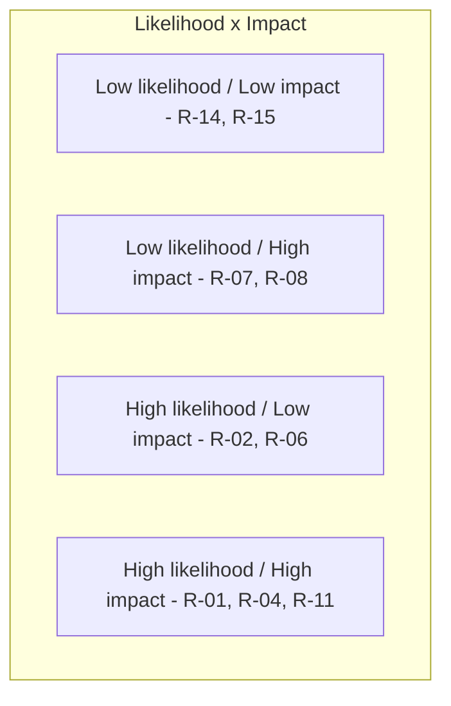
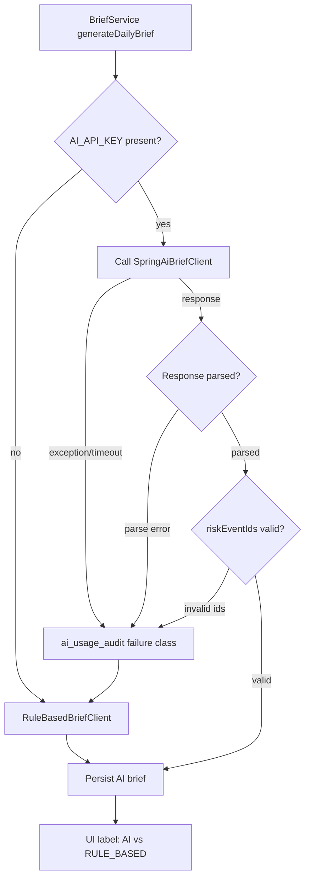

# OpsPulse-AI — Risk Register

> Status: Draft v0.1
> Last updated: 2026-07-10
> Companion: [PRD.md](PRD.md), [ARCHITECTURE.md](ARCHITECTURE.md), [DEPLOYMENT.md](DEPLOYMENT.md)

## 1. Purpose

Catalogue technical and product risks that could threaten the project's free-tier hosted demo, data integrity, AI safety, or portfolio quality. Each risk has likelihood, impact, severity, mitigation, contingency, owner, and review date.

## 2. Severity Heatmap

## 3. Risk Register

| ID | Risk | Category | Likelihood | Impact | Severity | Mitigation | Contingency | Owner | Review | Status |
|---|---|---|---|---|---|---|---|---|---|---|
| R-01 | Free-tier backend memory ceiling < 512MB causes OOM under AI call + dashboard load | Technical | High | High | Critical | JVM tuning (`-XX:MaxRAMPercentage=75 -XX:+UseSerialGC`); slim Docker image; lazy JPA; Caffeine cache instead of Redis when RAM tight; AI response streamed/parsed without holding full buffer | Reduce batch size in outbox processor; disable Redis adapter; switch to rule-based brief | Backend | 2026-10-10 | Open |
| R-02 | Render free-tier cold start 30–90s after 15 min idle | Technical | High | Low | Medium | Keep-alive ping every 12 min to `/actuator/health` via cron-job.org or GitHub Actions; clearly document expected cold start in README | Move to Fly.io or accept cold start; upgrade to Render Individual ($7/mo) if reviewer complaints | Infra | 2026-10-10 | Open |
| R-03 | Neon free-tier 0.5 GB storage exceeded by audit_logs / outbox_events growth | Technical | Medium | High | High | Cleanup jobs (outbox 30d, processed_events 30d, import_row_errors 90d, refresh_tokens expired+7d); document retention in [DATA_MODEL.md §12](DATA_MODEL.md); monitor storage via `/actuator/prometheus` (Neon exporter optional) | Manually purge old audit_logs (keep last 90d); upgrade to Neon Launch | Backend | 2026-10-10 | Open |
| R-04 | AI provider failure / timeout / rate limit breaks brief feature | Technical | Medium | High | High | Rule-based fallback brief ([ADR-003](ADR/ADR-003-use-byok-ai-provider.md), [ADR-005](ADR/ADR-005-risk-engine-before-ai.md)); 15s timeout + 1 retry on 5xx; `ai_usage_audit` records failure class | Fallback is automatic; UI labels "AI disabled — showing rule-based brief" | AI | 2026-10-10 | Open |
| R-05 | AI hallucinates metrics not grounded in risk events | AI | Medium | High | High | Risk engine deterministic-first; response parser validates `riskEventIds` exist; reject responses referencing unknown ids; rule-based fallback | Parser rejects → fallback brief; flag in UI | AI | 2026-10-10 | Open |
| R-06 | AI cost overrun under BYOK (user-owned key) | Product | Low | Low | Low | BYOK — cost belongs to user, not project owner; document expected token usage per brief; allow user to disable AI via env | User revokes key; rule-based brief runs | Product | 2026-10-10 | Open |
| R-07 | CSV import data quality (encoding, duplicate rows, malformed fields) | Technical | Low | High | High | Row-level validation; idempotency via `Idempotency-Key` + file hash; `import_row_errors` table with raw row + error; preview endpoint (future) | Reject file; return row errors; user fixes and re-uploads with new idempotency key | Backend | 2026-10-10 | Open |
| R-08 | Stock consistency bug from concurrent inventory adjustments | Technical | Low | High | High | Pessimistic row lock on `products` during movement (`SELECT FOR UPDATE`); optimistic `version` column for non-movement updates; transactional movement insert + stock update + audit + outbox | Retry on `OptimisticLockException`; admin reconciliation report | Backend | 2026-10-10 | Open |
| R-09 | Outbox retry storm / poison messages | Technical | Medium | Medium | Medium | Exponential backoff (1s,2s,4s,8s,16s); max 5 retries then `DEAD`; admin endpoint to replay/discard; `next_attempt_at` indexed for poller | Mark DEAD; manual intervention via admin endpoint | Backend | 2026-10-10 | Open |
| R-10 | Scope creep (PDF export, multi-tenant, more risk types, mobile) | Product | High | Medium | High | PRD §6 out-of-scope explicit; ROADMAP phases enforced; ADRs gate new architecture decisions | Defer to Phase 8+ or future repo | Product | continuous | Open |
| R-11 | Deployment platform changes (Render/Neon/Upstash drop or change free tier) | External | Medium | High | High | Quarterly re-verification per [ADR-004](ADR/ADR-004-slim-free-tier-deployment.md); DEPLOYMENT.md §10 checklist; ADR-004 alternatives table | Migrate to Fly.io / Supabase / Aiven; update ADR-004 | Infra | quarterly | Open |
| R-12 | Secret leakage (AI API key in logs / frontend / response) | Security | Low | Critical | Critical | BYOK env var only; adapter reads once at construction; Spring AI logging set to WARN; grep test in CI for `AI_API_KEY` value; code review checklist; never echo key in DTO/exception/audit | Rotate key; audit log review; fix leakage path | Security | 2026-10-10 | Open |
| R-13 | N+1 queries on dashboard aggregate | Technical | Medium | Medium | Medium | JPA projections / DTO constructors; `@EntityGraph` for hot paths; pagination; integration test with `hibernate.query.interceptor` detecting N+1; EXPLAIN on slow queries | Caching layer (Caffeine or Upstash); manual query rewrite | Backend | 2026-10-10 | Open |
| R-14 | JWT theft / refresh token abuse | Security | Low | Low | Low | Short access token TTL (15 min); refresh token rotation; `refresh_tokens` table with `token_hash` + `revoked_at`; IP/UA binding optional; logout revokes | Revoke all tokens for user on suspicion; user re-login | Security | 2026-10-10 | Open |
| R-15 | Demo data drift breaks deterministic tests | Technical | Low | Low | Low | Repeatable Flyway `R__seed_demo_data.sql` with fixed checksum; tests use Testcontainers + same seed; CI re-applies seed | Re-apply seed; update fixtures | Tests | 2026-10-10 | Open |

## 4. AI Failure Escalation Path

## 5. Top 5 Watchlist (active attention)

1. **R-01** — Memory ceiling: verify RSS after AI + dashboard combined load test.
2. **R-11** — Free-tier platform stability: quarterly re-verification.
3. **R-04 / R-05** — AI safety: fallback + hallucination guard tested in CI.
4. **R-08** — Stock consistency: integration test for concurrent movements.
5. **R-12** — Secret leakage: grep test in CI; code review checklist enforced.

## 6. Residual Risk Summary

After mitigations, residual risk is **Medium** overall:
- Cold start UX (R-02) is accepted as a free-tier trade-off, mitigated by keep-alive.
- Single-instance no-HA (Render free) is accepted; data durability lives in Neon.
- AI hallucination (R-05) is contained by deterministic risk engine + parser, but cannot be zero.
- Free-tier platform risk (R-11) is inherent; mitigation is monitoring + migration playbook.

## 7. Review Cadence

| Cadence | Activity |
|---|---|
| Weekly during Phase 7 | Re-check R-01, R-02, R-13 against live demo metrics. |
| Monthly | Re-verify free-tier platform pages (R-11). |
| Quarterly | Full risk register review; update statuses, severities, mitigations. |
| On incident | Update affected risk row + link post-mortem (per AGENTS.md `post-mortem` skill). |

## 8. References

- [PRD.md](PRD.md)
- [ARCHITECTURE.md](ARCHITECTURE.md)
- [DEPLOYMENT.md](DEPLOYMENT.md)
- [ADR/ADR-003 — BYOK](ADR/ADR-003-use-byok-ai-provider.md)
- [ADR/ADR-004 — Free-tier deployment](ADR/ADR-004-slim-free-tier-deployment.md)
- [ADR/ADR-005 — Risk engine before AI](ADR/ADR-005-risk-engine-before-ai.md)
