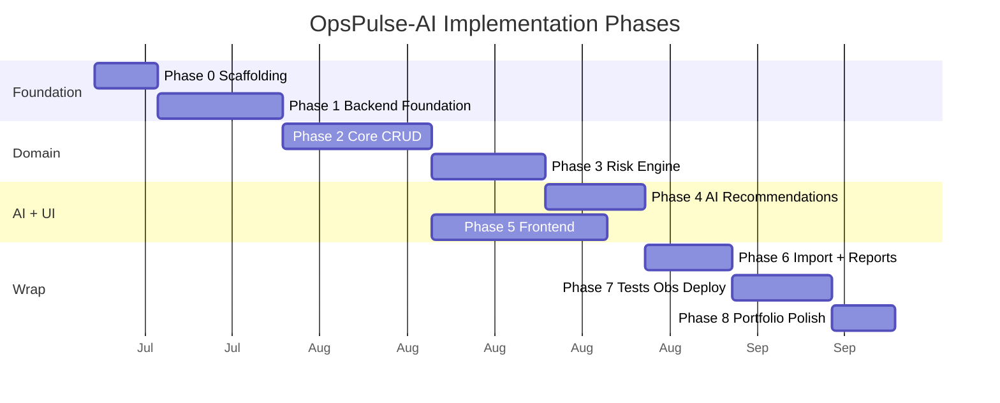
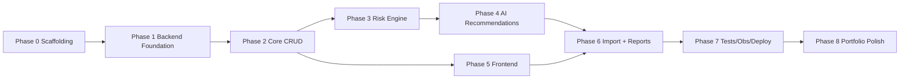

# OpsPulse-AI — Roadmap

> Status: Draft v0.1
> Last updated: 2026-07-10
> Companion: [PRD.md](PRD.md), [ARCHITECTURE.md](ARCHITECTURE.md)

## Phase Overview

Eight phases from scaffolding to portfolio polish. Each phase has a clear scope, deliverables, exit criteria, dependencies, and suggested issue labels. Phases are sequential where dependencies require, but Phase 5 (frontend) may overlap Phase 4 (AI) once Phase 2 contracts are stable.

## Phase Timeline

## Phase Dependency Graph

---

## Phase 0 — Repo Scaffolding

**Scope:** Bootstrap repository, build tool, Docker, Spring profiles, CI skeleton, README stub.

**Deliverables:**
- Gradle Kotlin DSL single-module setup producing one Spring Boot deployable, with package-enforced modular boundaries from [ARCHITECTURE.md §4.2](ARCHITECTURE.md#42-package-layout).
- Spring Boot 3.x + Java 21 toolchain configured.
- `Dockerfile` (multi-stage, JRE 21 slim runtime).
- `docker-compose.yml` (Postgres + backend, profile `local`).
- Spring profiles `local`, `test`, `prod`, `fullstack`.
- GitHub Actions CI: build + test on push.
- `.gitignore`, `.editorconfig`, `CONTRIBUTING.md` stub.
- README stub with project name + WIP notice.

**Exit criteria:**
- `./gradlew build` green.
- `docker compose up` boots Postgres + backend; `/actuator/health` returns 200.
- CI green on a trivial test.

**Dependencies:** none.

**Suggested issue labels:** `infra`, `backend`, `docs`.

---

## Phase 1 — Backend Foundation

**Scope:** Auth, RBAC, Flyway baseline, error handling, observability baseline, OpenAPI.

**Deliverables:**
- Spring Security + JWT filter chain; BCrypt password encoder.
- Roles `ADMIN`, `MANAGER`, `OPERATOR`, `VIEWER`; method-level `@PreAuthorize`.
- Flyway `V1__init_auth_user.sql`, `V8__audit_logs.sql`.
- `CorrelationIdFilter` + MDC logging (JSON).
- `@RestControllerAdvice` global error envelope.
- Actuator: `/actuator/health`, `/actuator/info`, `/actuator/prometheus`.
- springdoc-openapi with `bearer-jwt` security scheme.
- Audit base infrastructure (writer + reader).

**Exit criteria:**
- Login + refresh works for all 4 roles.
- Unauthorized call returns 401; wrong-role returns 403.
- OpenAPI served at `/v3/api-docs`; Swagger UI at `/swagger-ui.html`.
- All errors return the standard envelope with `requestId`.

**Dependencies:** Phase 0.

**Suggested issue labels:** `backend`, `database`, `tests`, `docs`.

---

## Phase 2 — Core Domain CRUD

**Scope:** Implement products, suppliers, orders, POs, inventory movements, audit log integration.

**Deliverables:**
- `products`, `suppliers`, `orders`+`order_items`, `purchase_orders`+`purchase_order_items`, `inventory_movements` Flyway migrations.
- JPA entities + repositories + mappers (entity ↔ domain ↔ DTO).
- Application use cases for CRUD with port-based persistence.
- Transactional inventory movement (pessimistic lock + audit + outbox).
- Audit log writes on create/update/delete.
- Outbox `outbox_events` migration + `OutboxPublisher` (write-side only; processor in Phase 3).
- CloudEvents envelope builder + unit tests.
- Integration tests (Testcontainers) for each module's critical paths.

**Exit criteria:**
- All CRUD endpoints pass integration tests per [API_CONTRACT.md](API_CONTRACT.md).
- Inventory movement TX verified: stock update + movement insert + audit + outbox in one TX.
- Audit log populated for all write operations.
- Negative stock blocked unless `allowNegativeStock=true`.

**Dependencies:** Phase 1.

**Suggested issue labels:** `backend`, `database`, `tests`.

---

## Phase 3 — Risk Engine

**Scope:** Pluggable risk rules, scheduler, risk events, outbox processor.

**Deliverables:**
- `risk_events` migration + JPA.
- `app_config` migration + typed access for risk thresholds and scheduler settings.
- Critical risk and outbox indexes created with their owning table migrations; supplemental index migration reserved for measured optimizations.
- `RiskRule` interface + registry (Spring bean discovery).
- Six rules: `StockoutRiskRule`, `OverstockRiskRule`, `SlowMovingRiskRule`, `OrderDelayRiskRule`, `SupplierDelayRiskRule`, `LowMarginRiskRule`.
- `MetricRepository` for pre-computed aggregates (avg daily sales 7d/30d, late delivery rate).
- `RiskScheduler` Spring `@Scheduled` job (cron from `app_config.riskScanCron`).
- `OutboxProcessor` scheduler: `SELECT FOR UPDATE SKIP LOCKED`, dispatch, retry/backoff, DEAD status.
- `processed_events` dedup table + idempotent in-process consumers.
- Unit tests per rule; integration test for end-to-end scan → events → outbox.

**Exit criteria:**
- All 6 rule unit tests green with deterministic `RiskContext` fixtures.
- Scheduler produces expected risk events on demo dataset.
- Outbox row NEW → PROCESSED within scheduler interval.
- Replay of same CloudEvents `id` does not double-apply.

**Dependencies:** Phase 2.

**Suggested issue labels:** `backend`, `ai`, `database`, `tests`.

---

## Phase 4 — AI Recommendations

**Scope:** Provider-agnostic AI adapter, prompt versioning, brief generation, fallback.

**Deliverables:**
- `ai_recommendations`, `ai_recommendation_items`, `prompt_versions`, `ai_usage_audit` migrations.
- `OperationsBriefClient` outbound port (`ai.application.port.out`).
- `SpringAiBriefClient` adapter (Spring AI 1.0, conditional on `AI_API_KEY`).
- `RuleBasedBriefClient` fallback adapter.
- `PromptBuilder` reading active `prompt_versions.template`.
- `BriefService` use case: load top risks → build prompt → call client → parse → persist → audit.
- Timeout (15s) + 1 retry on 5xx; no retry on 4xx.
- Response parser validates `riskEventIds` exist; rejects hallucinated references.
- AI usage audit (no secrets; sanitized `error_class`).
- Endpoint `POST /api/ai/recommendations/generate` + approve/reject/feedback.

**Exit criteria:**
- BYOK brief generated when `AI_API_KEY` set.
- Fallback brief generated when key absent.
- Prompt version persisted; `ai_usage_audit` row created per call.
- No `AI_API_KEY` value in any log line (grep test).
- Hallucination guard test: mocked AI response with bad `riskEventId` triggers fallback.

**Dependencies:** Phase 3.

**Suggested issue labels:** `ai`, `backend`, `database`, `tests`.

---

## Phase 5 — Frontend

**Scope:** React + Vite + TS app with all required pages and RBAC-driven UX.

**Deliverables:**
- Vite + React + TypeScript + Tailwind (or clean CSS).
- API client (typed; generated from OpenAPI optional).
- Auth context + JWT storage + role-based route guards.
- Pages: login, dashboard, products, suppliers, orders, purchase orders, risk events, AI daily brief, reports, import demo data, admin/users (optional).
- Loading / empty / error states on every data view.
- Dashboard widgets matching `/api/dashboard` aggregate.
- AI brief page showing AI vs RULE_BASED labelling.
- Cloudflare Pages build config (`VITE_API_BASE_URL` env).

**Exit criteria:**
- All pages render with sample data; navigation works.
- RBAC hides actions the user's role cannot perform.
- Dashboard loads < 1.5s on demo dataset.
- Cloudflare Pages build succeeds; preview URL works.

**Dependencies:** Phase 2 (CRUD contracts); can overlap with Phases 3–4 using mocked risk/brief endpoints.

**Suggested issue labels:** `frontend`, `portfolio`, `tests`.

---

## Phase 6 — Import & Reports

**Scope:** CSV import service + 5 report endpoints.

**Deliverables:**
- `import_jobs`, `import_row_errors` migrations.
- CSV parser (Apache Commons CSV or OpenCSV).
- `ImportService` with idempotency, file hash, row-level validation, async processing.
- Endpoints: `POST /api/imports` (multipart), `GET /api/imports`, `GET /api/imports/{id}`, `GET /api/imports/{id}/errors`.
- 5 report endpoints: daily ops brief, inventory risk, supplier SLA, order delay, product margin.
- Frontend import page with file upload + job status polling + error display.
- Frontend reports page with JSON-rendered tables.

**Exit criteria:**
- CSV import idempotent (same `Idempotency-Key` replays).
- Row-level errors returned with row number + raw row + message.
- All 5 reports return correct aggregates on demo data.
- Duplicate import blocked by file hash + idempotency key.

**Dependencies:** Phase 4 (for daily ops brief report); Phase 5 (frontend pages).

**Suggested issue labels:** `backend`, `frontend`, `database`, `tests`.

---

## Phase 7 — Tests, Observability, Deployment

**Scope:** Hardening, observability, deployment to free tier.

**Deliverables:**
- Testcontainers integration suite covering all critical API flows.
- Unit test coverage >= 80% on domain + risk engine + AI prompt builder + CloudEvents envelope.
- JaCoCo report in CI.
- Local full stack: `docker-compose.full.yml` with Redpanda + Prometheus + Grafana; outbox publishes to Kafka; Grafana dashboards (JVM, risk generation, outbox lag, AI latency).
- Dockerfile slim image (multi-stage, JRE 21, JVM args for free-tier).
- Render deployment config (Docker, `PORT`, health check).
- Cloudflare Pages deployment (frontend).
- Neon Free Postgres project; Flyway migrations applied via release stage.
- Optional Upstash Redis cache (dashboard aggregate caching).
- Smoke test script: `/actuator/health`, login, dashboard, brief.
- Keep-alive ping (cron-job.org or GitHub Actions) every 12 min.

**Exit criteria:**
- Hosted demo live: frontend URL + backend URL + Swagger UI.
- `/actuator/health` 200 within 90s of cold start.
- Dashboard warm response < 1.5s.
- Backend RSS < 512MB on Render.
- Testcontainers suite green in CI.
- Prometheus scraping `/actuator/prometheus` locally; Grafana shows dashboards.

**Dependencies:** Phases 1–6.

**Suggested issue labels:** `tests`, `infra`, `deployment`, `observability`.

---

## Phase 8 — Portfolio Polish

**Scope:** Make the project compelling to reviewers.

**Deliverables:**
- README complete per [README.md plan](../README.md): business-impact framing, architecture diagram, ER diagram, sequence diagrams, screenshots/GIF placeholders, demo data summary, API docs links, known limitations, future improvements, Hosted vs Local explanation.
- Demo credentials documented (admin/manager/operator/viewer) — clearly marked as demo-only.
- Sample data seeded deterministically; resettable via endpoint.
- Loom/GIF walkthrough of login → dashboard → AI brief → import flow.
- Blog post or LLM write-up summarizing architecture decisions (link to ADRs).
- Known limitations section: cold starts, 0.5GB Neon storage, BYOK for AI, no PDF, single-tenant.
- Future improvements: multi-tenant, PDF export, SSE live dashboard, Kafka in prod, mobile app.
- LinkedIn/portfolio site link.

**Exit criteria:**
- README passes 5-minute reviewer test (business value + architecture visible).
- All 10 planning docs cross-linked and consistent.
- Hosted demo URL in README; demo credentials documented.
- At least 3 screenshots/GIFs embedded.

**Dependencies:** Phase 7.

**Suggested issue labels:** `portfolio`, `docs`.

---

## Cross-Cutting Work (continuous)

| Workstream | Phase(s) | Notes |
|---|---|---|
| ADR updates | all | Revisit ADRs when assumptions change. |
| Risk register review | 3, 4, 7 | Update [RISK_REGISTER.md](RISK_REGISTER.md) as risks materialize or close. |
| Free-tier platform re-verification | 7, 8 | Quarterly per [ADR-004](ADR/ADR-004-slim-free-tier-deployment.md). |
| Performance pass | 5, 7 | Dashboard < 1.5s; no N+1; indexes verified. |
| Security review | 1, 7 | JWT, CORS, secret hygiene, RBAC matrix. |

## Suggested First 5 Issues

1. `phase-0` `infra` — Initialize single-module Gradle Kotlin DSL build + Spring Boot 3 + Java 21.
2. `phase-0` `backend` — Establish feature-first package boundaries and architecture tests.
3. `phase-0` `infra` — Configure local/test/prod/fullstack profiles.
4. `phase-0` `deployment` — Author the multi-stage Dockerfile and minimal local `docker-compose.yml`.
5. `phase-0` `tests` — Add GitHub Actions build/test quality gate.

See [GITHUB_ISSUES.md](GITHUB_ISSUES.md) for the full breakdown.

## References

- [PRD.md](PRD.md)
- [ARCHITECTURE.md](ARCHITECTURE.md)
- [GITHUB_ISSUES.md](GITHUB_ISSUES.md)
- [RISK_REGISTER.md](RISK_REGISTER.md)
- [DEPLOYMENT.md](DEPLOYMENT.md)
